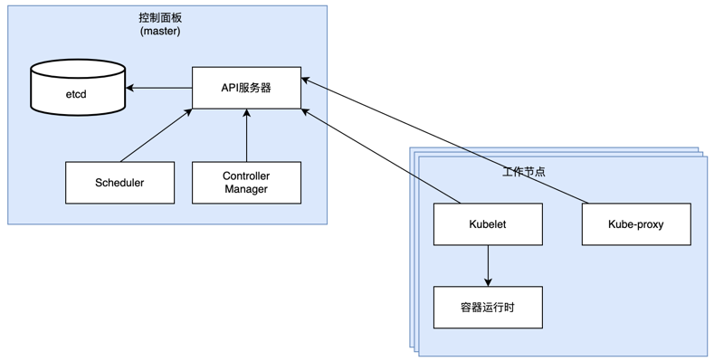

# Kubernates简介

## 应用程序的开发部署变化

### 从单体应用到微服务

#### 单体应用的缺点

- 由多个彼此耦合的组件组成,开发、部署、管理必须以同一个实体进行,即使对某个组件的小修改也需要重新部署整个应用

- 组件之间没有严格的边界定义,相互依赖,随着功能的丰富,导致系统日趋复杂,整体质量严重下降

- 运行单体应用,需要一台能为整个单体应用提供足够资源的高性能服务器

- 为应对不断增长的系统负荷,我们需要不断增加CPU、内存等做垂直扩展,但成本会越来越高,并且会有瓶颈

- 增加更多运行应用程序服务器做水平扩展,但可能会需要做比较大的修改,有时甚至不可行,如果某个组件不能扩展,则整个应用不能扩展

#### 微服务应用的优势

- 复杂的大型单体应用拆分为小的可独立部署的微服务,微服务之间通过类似HTTP的同步通信协议通信或者通过类似AMQP这样的异步通信协议通信,每个微服务可以使用合适的语言开发

- 改动一个微服务不需要改动或重新部署其它微服务

- 单体系统扩容需要对整个系统，如果其中存在部分不能扩容，则可以把应用拆分成多个微服务。对于微服务而言，我们可以针对需要更多资源的服务进行扩容，
而其它服务仍然保持不变。我们通常可以将能扩容的服务进行水平扩容，不能扩容的组件进行垂直扩展
  
#### 微服务应用的缺点

- 随着微服务规模的扩展，微服务数量急剧增加，部署相关的决定会变得越来越困难，不仅组件部署的组合数在增加，组件间依赖的组合数也在增加

- 部署者需要正确的配置所有的微服务来使其作为一个单一系统能正确工作，当微服务增加时，配置工作变得冗杂并且易错

- 跨多个进程和主机的业务代码调试变得更加困难，问题难以定位

- 由于微服务自建的独立性，导致不同微服务很有可能是不同团队开发，因此整个系统中，对同一个库的不同版本需求是不能避免的，这对于运维人员来说是
困难的，因为需要在同一个主机上部署的组件数量越大，满足这些组件的所有需求就越难
  
### 提供一致的环境
从开发到产品交付，整个流程中，我们会有很多的环境，我们总是希望不同环境是保持一致的，但现实是不同环境之间存在巨大差异，并且各个主机之间也存在
差异。并且主机的环境也不是固定不变的。这些差异包括硬件到操作系统再到安装的可用库上。并且运维人员和开发人员所关注的点也不同。开发人员只关心
自己负责应用的功能。而运维人员更关注多个产品的运行维护及系统环境的更新，不同产品之间依赖的组件库也可能会有冲突

为减少到生成环境才暴露的问题，我们总是希望让应用运行的开发环境和生成环境是一样的，包括操作系统、库、系统配置、网络环境等，并且也不会随时间的
推移而发生变化。最好是新部署的其它应用产品对之前已有的产品不会造成任何影响

### 持续交付：DevOps+无运维
在之前，开发团队只负责创建应用并交付运维团队，运维团队则负责部署应用并使之持续运行。但现在会让开发团队负责产品的开发、部署、运维整个生命周期这种
实践被称为DevOps

#### DevOps持续交付的优点
- 让开发者在生成环境中运行应用，使对用户的需求和问题，及运维团队维护应用面临的困难有更好的理解

- 开发者趋向于将应用尽快发布上线，通过收集用户反馈来对应用做进一步优化开发，快速响应用户变化

- 开发人员需要能自己部署应用上线，不需要交付给运维人员。但部署需要具备对数据中心和底层设备及硬件架构的理解，但开发人员通常不知道也不愿意去知道

#### 让擅长的人做擅长的事
开发人员：擅长创造新的功能、提升用户体验，但不擅长更新系统，维护系统及网络等工作

运维人员：擅长管理系统硬件设备、系统安全、使用率等。但不擅长处理所有应用组件之间的内部依赖关系，操作系统、基础设施改变对应用程序的影响

NoOps: 理想情况下开发人员部署应用程序本身，不关注也不需要知道基础设施的任何情况，无需和运维团队交涉

Kubernetes能让我们上面的愿景成为现实。通过对基础设施抽象，成一个K8S平台，用户部署、运行应用程序，只需要通过K8S即可，不需要系统管理员任何
帮助。而系统管理人员也能专注于底层基础设施的正常运转而无需关注之上的应用程序

## 容器技术
在同一台机器上运行的不同应用，可能需要不同的、存在冲突的依赖版本，或者其它不同的环境需求。当只是少数的大应用时，我们可以通过在同一台主机上
部署多个虚拟机来隔离不同应用的不同需求。但当大的单体服务微服务化后，急剧增加的微服务将不能再使用虚拟机方式隔离部署，因为虚拟机不仅运行应用进程，
还有额外的系统进程，这将浪费掉大量硬件资源，并且每个虚拟机单独配置管理也加大了运维人员的负担

### Linux容器技术
随着微服务数量的增加，同一台主机上部署多个微服务正在转向使用Linux容器技术。同一台主机上可以运行多个容器，每个容器提供隔离的不同的环境，但相对
于虚拟机，其消耗的资源要小很多

容器中的进程实际上是在宿主主机的操作系统上运行，但和其它进程是隔离的，就像只有容器中的进程在操作系统上运行。通过容器技术部署应用不会有其它进程
的额外开销，资源的消耗都是应用产生的。但由于都是使用的同一个系统内核，会有安全隐患

### Linux容器隔离机制
容器隔离通过两个机制实现：

- Linux命名空间：通过命名空间可以使进程只能看到自己的系统视图（文件、进程、网络接口、主机名等）
  
- Linux控制组（cgroups）：通过控制组可以限制进程使用的资源（CPU、内存、网络带宽等）

#### Linux命名空间
默认Linux只有一个命名空间，所有系统资源都属于这个命名空间。但我们可以创建其它命名空间，并且命名空间是有类型的，一个进程可以属于每个类型的一个
命名空间，分派给进程不同类型的命名空间，进程将只能看到改种类型命名空间限制的资源，命名空间分类如下

- Mount（挂载）
  
- Process ID （pid）
  
- Network （net）

- Inter-process communicaion（ipd）

- UTS

- User ID （user）

#### Linux控制组
cgroups是一个Linux内核功能，被用来限制一个进程或一组进程的资源使用，不能超过分配的量

### Docker容器平台
容器技术已经出现了很久，但随着Docker容器平台的出现，容器技术才得到普遍应用。Docker是第一个使容器能在不同机器上移植的系统。Docker简化了打包
应用的流程，也简化了打包库和依赖，并且可以打包整个操作系统的文件系统，并且可以被运行在任何其它运行Docker的机器上

#### 镜像层
Docker容器镜像是分层的，由多层构建而成，能在多个镜像之间共享和征用。如果已经下载的镜像包含了后面下载镜像的某些层，那后面下载的镜像就无需再
下载这些层。通常情况下我们制作镜像是都是基于某个基础镜像制作，而我们也可以自己制作的镜像也有可能会被其它镜像依赖构建，因此不同的镜像可能使用
相同的父镜像。由于镜像的分层使得镜像的分发效率得到提升

镜像分层也有助于减少镜像的存储空间。每一层仅会被存储一次。基于相同基础镜像被创建的两个容器，能读到相同的文件，但如果某个容器写入了某些文件，
另一个容器无法看见这些变化。因此虽然是共享相同的文件，但彼此又是隔离的。因为容器镜像是只读的，当容器运行时一个新的可写层在镜像之上被创建，
容器中进程写入位于底层的文件时，此文件的一个拷贝在顶层被创建，进程写的是拷贝

#### 容器镜像可移植性限制
理论上说一个镜像能运行在任何一个运行Docker的机器上，但实际上存在如下两个限制

- 内核版本：运行在一台机器上的所有容器共享主机的Linux内核。如果一个容器化应用需要一个特定的Linux内核版本，但所要运行的目标主机内核版本不匹配
或没有相同的内核模块可用，则不能在其上运行
  
- 硬件架构：在特定硬件架构上编译的容器应用，只能在有相同硬件架构的机器上运行。不能期望一个在x86架构上编译的应用容器镜像，又能在ARM架构的机器上
运行
  
## Kubernetes
随着可部署组件的增长，管理这些组件的部署将变的越来越困难。我们需要一种更好的方式来管理和部署这些组件。而Kubernetes就是这样的软件系统，其
可以管理数以千计的主机，并对这些基础设施抽象，提供统一的操作入口。用户可以通过Kubernetes部署、管理组件，而不用关心组件会部署到那个主机上，
并且通过Linux的容器技术，实现部署应用的隔离性。Kubernetes成了云"操作系统"

### Kubernetes集群架构
在硬件上一个Kubernetes集群由多个节点组成，这些节点可以分成如下两类

- 主节点：控制和管理整个集群系统的控制面板
  
- 工作节点：运行用户实际应用

#### 控制面板
控制面板用于控制集群并使集群能正常运行。其包含多个组件，这些组件既可以运行在单个主节点上，也可以通过副本运行在多个主节点上，实现高可用。
他们不会运行用户的应用程序，只用于控制集群状态。包含的组件如下

- Kubernetes API服务器：提供HTTP API，以供用户、集群中的不同组件和集群外的组件交互，并切可以通过API查询、操作Kubernetes API中的对象
  
- Scheduler调度器：调度用户应用（pod）到适合的节点

- Controller Manager控制器管理器：守护进程，永无休止的循环，用于调节系统状态，每个控制器是一个控制回路，通过API服务器监视集群的共享状态，
并尝试更改以将当前状态转为期望状态。自带的控制器包括副本控制器、节点控制器、命名空间控制器、服务账号控制器等
  
- etcd键值存储：一个可靠的分布式数据存储，能持久化存储集群配置

#### 工作节点
运行容器化应用的机器。运行、监控和管理应用服务的任务由下面组件完成

- Docker、rtk或其他的容器类型

- Kubelet：与API服务器通信，管理所在节点的容器，在每个节点上运行

- Kubernetes Service Proxy（kube-proxy）：负责组件之间的负载均衡网络流量，在每个节点上运行

## Kubernetes中运行应用
要在Kubernetes中运行应用，我们需要进行如下步骤

- 基于应用制作镜像，并将镜像推到镜像仓库

- 编写Kubernetes部署应用所需的描述文件，通过声明式的配置，描述Kubernetes需要使用什么镜像及其他配置需求来创建Pod部署
应用容器
  
- 将声明式的描述文件发布到Kubernetes，Kubernetes将按用户的期望配置，完成应用的部署

### 从声明式文件到运行的应用容器

API服务器处理应用声明式描述时，调度器根据描述的资源需求，及每个节点未分配资源情况，调度指定组的容器（pod）到可用的工作节点上。节点上的Kubelets
将告诉Docker拉取镜像运行容器

### 保持容器运行
Kubernetes会不断确认应用程序的部署状态是否与用户描述文件期望的状态一致，如果不一致，会不断尝试将部署状态调整到一致。例如用户描述文件中需要
运行5个应用实例，如果运行的应用实例容器没有达到5个，Kubernetes将启动新的应用容器，直到达到5个。当工作节点死亡或丢失时也会在其它可用节点上
重新补齐丢失掉的应用容器

## Kubernetes带来的价值

### 简化应用程序部署
Kubernetes将所有工作节点抽象为一个部署平台，开发人员可以基于Kubernetes方便的部署应用，而无需关注底层基础设施。当然对于关注节点基础设施的应用
Kubernetes也提供了方便的属性，可以设置应用在具有某些特性的节点上运行。例如某个应用程序需要在SSD基础设施的节点上运行，可以通过给节点打上SSD
的标签，用户在应用程序的描述文件中指定在具有SSD标签的节点上运行，Kubernetes在调度应用程序pod时将只会调度到SSD标签的节点上

### 硬件利用率更高
通过声明式的描述文件，可以告诉kubernetes应用需要的资源限制，kubernetes可以根据应用的资源限制及节点剩余资源情况、节点特性做出最优调度

### 健康检查与自修复
Kubernetes监控应用程序和节点，当节点出现故障时，会自动将应用重新调度到其它可用节点

### 自动扩缩容
借助kubernetes的HPA资源，自动根据应用CPU利用率、内存使用情况及自定义的指标进行自动扩容缩容，即能
节约资源消耗，也能在高峰时自动扩容保持高可用

### 升级回滚
Kubernetes提供了升级回滚的机制，当发布的新版本有问题时可以自动回滚。当遇到新版本有问题时我们也可以方便的回滚到历史版本。

### 统一的环境
应用程序开发环境和正式环境是一样的，这样更利于我们尽早发现问题，解决问题的代价也最小。越往后面发现的问题解决的代价也越大

### 提供统一的解决方案
提供了DNS查询、服务发现等支持，配合Istio更是可以做到无侵入的实现熔断、限流等特性，而无需用户编写业务代码实现