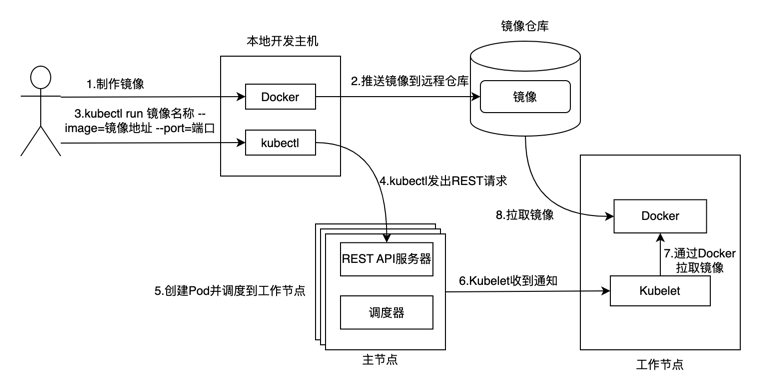
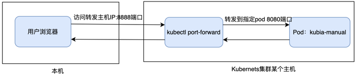
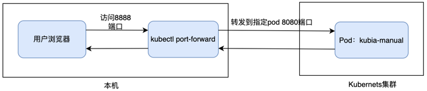

# 运行于Kubernetes中的容器
在通过docker运行程序时，我们通常会制作Dockerfile文件构建镜像。也可以基于某个镜像运行容器在容器中安装组件之后，再基于容器生成镜像

使用如下命令可生成镜像，想了解更多参数请添加--help
```
docker build -f Dockerfile路径 -t tag名称 .
```
在制作好镜像之后，可以使用docker命令运行镜像。命令如下，参数含义请添加--help了解
```
docker run --name kubia -p 8080:8080 -d kubia
```

当使用docker管理部署应用时，如果应用较多、环境较多管理相当麻烦，且对于扩容、缩容、环境稳定性等也极不好处理。借助Kubernetes 容器编排我们可以
方便的管理这些容器，实现高可用、动态伸缩、滚动升级等等特性

使用如下指令，通过kubectl命令运行镜像
```
kubectl run kubia --image=luksa/kubia --port=8080
```
--image=luksa/kubia指定要运行的镜像，run后指定的kubia为运行镜像产生的pod名称

可以通过如下指令查看pod列表
```
kubectl get pods
```
下面我们来详细介绍Kubernetes中pod的概念

## pod介绍
Kubernetes并不会直接管理单个容器。而是以容器组的形式管理，一个pod就是一组紧密相关的容器组。通常情况下一个pod中只会有一个容器，但有些时候我们
需要一些辅助容器才能完成需要提供的功能，例如docker in docker方案中我们可以在pod中运行一个官方提供的docker容器，此docker容器中包含docker服务端，
我们业务容器可以通过docker客户端连接到同pod中的docker容器制作镜像

在同一个pod中运行的容器总是运行在一起，并且运行在同一个工作节点上，以及同一个Linux命名空间。每个pod就像一个独立的逻辑主机，拥有自己的IP、
主机名、进程等

通过如下命令可以查看指定命名空间下的pod列表，如果不指定命名空间则查询默认命名空间下pod列表
```
kubectl get pods -n 命名空间
```
当pod久久没有达到running状态，或者出现异常时，我们可以执行如下指令查看原因
```
kubectl describe pod 名称 -n 命名空间
```
在Kubernetes中运行容器镜像其内部流程如下


### 访问pod
在pod就绪之后，我们需要访问pod，每个pod都有自己的IP地址，这个地址是集群内部的地址，如果想要外部访问pod，需要通过service资源暴露pod。我们可以
通过service类型的yaml描述文件创建。也可以简单通过kubectl expose命令创建，详细的参数配置可以添加--help了解

运行如下指令暴露上面创建的pod资源
```
kubectl expose pod pod名称 --type=LoadBalancer --name kubia-http -n 命名空间
```
service type支持ClusterIP、NodePort、LoadBalancer、ExternalName。LoadBalancer类型并不是所有集群都支持，如果不支持可以使用NodePort
类型暴露pod

通过如下命令可以查询指定命名空间下service资源类型
```
kubectl get services -n 命名空间名称
```
在列出的service资源列表的port列可以查看端口情况，例如8080:30545/TCP，其中8080为应用程序的容器端口，30545为映射的节点端口。可以通过
节点ip:节点端口 访问应用程序

## pod的必要性

### 多个容器单进程&单个容器多进程
如果一个应用由多个进程组成，无论通过ipc（进程间通信）还是本地存储文件进行通信，都要求这些进程运行在同一台机器上。在Kubernetes中，我们通常在
容器中运行进程，由于每个容器都像一台独立的主机，因此认为在单个容器中运行多个进程是合理的，但事实恰恰相反

容器被设计为只运行单个进程。如果在单个容器中运行多个不相关进程，那么保持这些进程运行、管理他们的日志等将会是K8s的责任。例 我们需要一种在进程
崩溃时能自动重启的机制。同时这些进程产生的日志都将记录到相同的标准输出中，此时我们将很难确定每个进程分别记录了什么

因此我们需要让每个进程运行在单个容器中，这也正是docker和k8s期望的方式。由于不能将多个进程放在一个容器中运行，因此我们需要一种更高级的结构来
将容器绑定在一起，作为一个单元进行管理。在一个pod中，我们可以同时运行一组密切相关的进程，并为这些进程提供相同的环境，每个进程都在一个单独的容器
中运行，这些进程好像全部运行在一个容器中一样，同时又保持着隔离性。这样既能全面利用容器的特性，又能使这些进程像运行在一起

### 同pod容器之间的部分隔离
在K8S中我们期望以容器组的维度去隔离，而不是以单个容器维度隔离。一个pod就是一组紧密相关的容器，容器组中的容器共享一些资源，但不是共享所有资源。
K8S通过配置Docker来让一个pod内的所有容器共享相同的Linux命名空间，而不是每个容器都有自己的一组命名空间

pod中的容器都在相同的network和UTS命名空间运行，所以这些容器共享相同的主机名和网络接口。同时这些容器也在相同的IPC命名空间下运行，因此也能通过
IPC进行通信。在新版本的Kubernetes和docker版本中，也能共享相同的PID命名空间，但默认是未开启的，如果开启则在同一pod中的任一容器可以通过ps aux看到
该pod中所有容器运行的进程

容器的文件系统来自容器镜像，因此默认情况下，每个容器的文件系统与其他容器完全隔离，但可以使用Volume来在容器之间共享文件目录

### 容器IP和端口空间共享
同一个pod中运行的容器共享相同的网络命名空间，因此他们共享相同的IP和端口空间。如果同一个pod中的多个容器，运行的进程有绑定相同的端口号，则会出现
端口冲突的问题。对于不同pod则不会有这个问题，因为每个pod都有独立的端口空间。同时一个pod中的容器也有相同的loopback网络接口，因此可以通过localhost
与同一pod中的其它容器进行通信

### pod间网络
K8S中所有pod都在同一个共享网络地址空间中，每个pod都可以通过其它pod的IP地址实现相互访问，它们之间没有NAT网关，不会进行网络地址转换。当两个
pod彼此之间发送网络数据包时，它们都将对方的实际IP地址视为数据包中的源IP

不论两个pod是否在同一个工作节点，不论节点间的网络拓扑结构如何，pod中的容器都可以像在无网络地址转换的扁平网络中那样相互通信，每个pod都有一个
K8S集群内的IP地址，pod间可以通过K8S提供的网络模型相互访问

## 合理规划pod
K8S中pod作为最小管理单元，尽管每个pod可以包含多个容器，但并不建议将所有应用放入同一个pod中，我们推荐将紧密相关的一组容器放入一个pod中，
所谓的紧密相关是指两个容器互相依赖缺一不可，而且紧密协作，必需放在一起运行

对于一个由前端和后端数据库组成的应用程序，尽管两者之间也是紧密协作实现功能，但二者并不是必需运行在一起才行，如果我们其放入同一个pod中会导致哪些问题？

### 从资源利用率考虑
同一个pod中的容器总是一起运行在相同节点上，而对于由多个节点组成的K8S集群来说，这并不能最大效率的利用各节点的计算资源。合理的做法是尽量拆分到
多个pod中

### 从扩缩容考虑
K8S中扩缩容的基本单位是pod，但不同应用服务其需求不同，扩缩容策略也不同。例如对于前端服务这种无状态的服务，对于用户访问量加大时，需要多运行
些；而像后端数据库这种有状态服务，其扩容相对来说要复杂些，而且其扩容的策略也与前端不同。因此尽量拆分到多个pod中

### 多容器pod
如果在考虑是否需要将两个容器放到同一个pod中时，可以参考以下几点

- 是否必须要在同一个主机上运行

- 是否二者在一起才是一个整体，还是是相互独立的组件

- 是否必需一起扩缩容，还是有不同的扩缩容策略

总是应该考虑在每个pod中运行一个容器，而不是多个。但如果一个应用是由一个主进程和子进程辅助完成用户需要但功能，那么他们应该放在同一个pod中，
例如开发一个流水线工具，此工具需要使用docker命令制作镜像，则在pod中除流水线工具容器，还需要一个官方提供的docker命令容器，实现docker in docker

## 通过描述文件定义pod
在上面我们通过kubectl run命令运行快速运行了一个pod，但通过命令只能支持有限的属性。除了使用命令我们还可以通过yaml或json描述文件来管理pod，
其实不只是pod，包括其他各种类型的资源都可以使用yaml或json文件描述。通过向Kubernetes REST API提供yaml或json文件即可完成对资源的创建或更新。
通过描述文件管理资源还可以存储在版本系统中，充分利用版本管理工具的版本控制

要使用yaml或json描述文件定义各种资源，需要知道每种资源对象可以使用的属性，通过查看[Kubernetes API](https://kubernetes.io/zh-cn/docs/reference/kubernetes-api/workload-resources/pod-v1/)
对象定义我们可以了解这些信息。我们也可以拉取Kubernetes客户端代码查看各资源对象的属性https://github.com/kubernetes/kubernetes.git

### 查看现有pod的描述文件
依然通过使用kubernetes get命令来获取pod的描述文件，其他类型资源也可以使用此命令获取其描述文件
```
kubernetes get pod pod名称 -n 命名空间 -o yaml
```
通过以上命令获取的pod资源描述文件包含的内容较多，但通过描述文件创建pod时并不用给出所有的字段，其中有些字段是Kubernetes设置的，比如status下
的字段描述的是当前pod的状态，这些字段不需要我们设置

### pod描述文件中的主要内容
不只是pod大部分Kubernetes中的资源都包含如下几部分
- apiVersion：api版本，由分组和版本组成，例如 batch/v1，当资源是核心组（core）下，则无需给出分组，例如 v1。详细参考https://kubernetes.io/zh-cn/docs/reference/using-api/

- kind：资源类型，例如 pod

- metadata：元数据，主要包含名称、命令空间、标签、注解、版本等信息

- spec：包含实际内容，如容器的镜像、卷、资源需求等

- status：资源当前运行状态信息，例如状态、内部IP等。不需要用户指定，由Kubernetes管理

### 通过YAML资源描述文件创建pod
```
apiVersion: v1
kind: Pod
metadata:
  name: kubia-manual
spec:
  containers:
  - image: luksa/kubia
    name: kubia
    ports:
    - containerPort: 8080
      protocol: TCP
```
可以看到这里的描述文件比通过get命令获取的要简单很多

- apiVersion：资源对象遵循Kubernetes v1版本，并且此资源是core组下的资源，大家如果想知道各资源的具体字段及版本等可以直接查看[kubernetes客户端源码](https://github.com/kubernetes/kubernetes.git)

- kind：指出描述的是pod类型的资源

- metadata.name：指定资源名称

- spec.containers[0].image：指定拉取的镜像，这里没有指定镜像仓库，将从[公共仓库](https://hub.docker.com/) 拉取

- spec.containers[0].name：指定容器名称为kubia

- spec.containers[0].ports[0].containerPort：指定容器的端口是8080
  
- spec.containers[0].ports[0].protocol：指定容器的端口使用的协议是TCP,另外也支持UDP、SCTP

### kubectl create根据描述文件创建pod
```
kubectl create -f 存放资源描述文件的路径 -n 命名空间
```
以上命令可以创建一个或多个资源，多个资源组织方式遵循yaml语法, 可以不使用-n 指定命名空间，默认为default命名空间，命名空间是对资源进行分类管理。
其他kubectl命令可以产考[官方文档](https://kubernetes.io/zh-cn/docs/reference/kubectl/)

可以使用如下命令创建一个namespace
```
kubectl create namespace 命名空间名称
```

#### 查询Pod描述文件
创建完pod之后可以使用上面介绍的命令获取描述文件，通过命令获取的描述文件比上面自定义的用于创建资源的描述文件要复杂很多
```
kubectl get pod kubia-manual -n 命名空间
```

#### 查看命名空间下Pod列表
使用如下命令可以查看命名空间下所有Pod的概要信息，以列表展示
```
kubectl get pods -n 命名空间
```
#### 查看Pod中容器日志
运行如下命令查看Pod中容器日志
```
kubectl logs pod名称 -n 命名空间
```
如果Pod中包含多个容器，则需要指定容器的名称
```
kubectl logs pod名称 -c 容器名称 -n 命名空间
```
***注意：每天或每当日志文件达到10MB时，容器日志就会自动轮替，kubectl logs命令仅显示最后一次轮替后的日志条目***

我们只能获取仍然存在的pod的日志，不能获取已经删除pod的日志，当pod删除时其日志也会随着删除，如果希望在pod删除之后仍然可以获取日志，则需要配置
中心花的、集群范围的日志系统，将日志都存储到中心存储中

### 访问pod资源
上面我们介绍过使用service资源暴露pod，除此之外也可以通过ingress资源暴露服务。但在平时验证、测试时我们只想简单验证，则可以使用kubectl port-forward
命令，通过端口转发的方式访问pod。在Kubernetes集群某台主机执行如下指令


```
kubectl port-forward --address 0.0.0.0 pod名称 8888:8080 -n 命名空间
```
- 上述命令可以将指定命名空间下，指定pod，通过执行指令主机8888端口转发到pod 8080端口

- --address：指定0.0.0.0表示监听主机所有地址，可以在本地浏览器通过http://主机所有IP:8888访问；也可以指定主机具体某个IP地址，可以本地浏览器通过http://指定的监听IP:8888访问；
如果不指定--address，则默认为localhost，只能在执行转发指令的主机通过curl http://localhost:8888访问
  
除了在Kubernetes集群某台主机执行端口转发指令外，也可以先配置好本地连接目标Kubernetes集群，在本地执行命令完成端口转发


```
kubectl port-forward pod名称 8888:8080 -n 命名空间
```
- 本地执行此指令后，即可在本地浏览器通过http://localhost:8888访问

## 标签
Kubernetes可以使用标签对资源进行管理，不只是pod资源，很多资源都可以设置标签，标签是可以附加到资源上的任意键值对。通过标签可以按照需要的维度
对资源进行管理，避免资源混乱。例如可以给资源附加版本标签，标注不同版本；同时可以附加环境标签，标注资源是开发环境还是测试环境；不同资源可能对
硬件要求不同，有的自需要普通磁盘，有的可能需要SSD磁盘，可以打上标签进行区别

在创建资源时可以设置标签，在更新资源时也可以设置更新标签，也可以单独附加或修改、删除标签。可以通过标签维护对资源进行查询过滤

### 创建Pod时指定标签
```
apiVersion: v1
kind: Pod
metadata:
  name: kubia-manual-labels
  labels:
    env: prod
    creation_method: manual
spec:
  containers:
  - image: luksa/kubia
    name: kubia
    ports:
    - containerPort: 8080
      protocol: TCP
```
- metadata.labels：指定标签，可以指定多个，键、值可以是任意字符串。标签限制要求可查看官方文档https://kubernetes.io/zh-cn/docs/concepts/overview/working-with-objects/labels/

### 查看资源列表并展示标签
```
kubectl get pod --show-labels -n 命名空间
```
- --show-labels：使用此参数，打印资源标签

通过-L选项可以指定需要展示的标签，这些标签将作为列表展示。而不是展示所有的标签
```
kubectl get pod -L creation_method,env -n 命名空间
```

### 修改标签
在已有资源上添加新标签可以执行如下指令
```
kubectl label pod pod名称 disk=ssd -n 命名空间
```
- 将在pod上添加新标签disk=ssd

对于已经存在的标签可以通过如下指令更新
```
kubectl label --overwrite pod pod名称 env=dev -n 命名空间
```
- 指定pod上的env标签将被更新为dev

删除已有标签可以执行如下指令
```
kubectl label pod pod名称 env- -n 命名空间
```
- 指定pod上的env标签将被删除

更多kubectl label指令参数详情可以运行如下指令查看
```
kubectl label --help
```

## 标签选择器
上面介绍了如何查看及创建、更新、删除标签，目前可能觉得标签并没有实际用处，但配合之后讲的Kubernetes的其他知识，我们会发现标签不可或缺，在
Kubernetes中有重要作用

想要对资源按标签进行检索，可以使用标签选择器，通过指定需要过滤的标签，可以检索出我们关心的资源

- 可以检索出包含或不包含特定键的标签

- 可以检索出特定键值对的标签

- 可以检索出具有特定键的标签，但其值与我们指定的不同

### 查询具有指定键值对的Pod
```
kubectl get pods -l disk=ssd -n 命名空间
```
- 查询出命名空间下，包含键值对disk=ssd的pod列表

### 查询具有指定键的Pod
```
kubectl get pods -l disk -n 命名空间
```
- 查询出命名空间下，包含disk键的pod列表

### 查询没有指定键的Pod
```
kubectl get pods -l '!disk' -n 命名空间
```
- 查询命名空间下，不包含键disk的pod列表

### 查询具有指定键但值不相同的Pod
```
kubectl get pods -l disk!=ssd -n 命名空间
```
- 查询命名空间下，具有disk键但值不为ssd的pod列表

### 查询具有指定键并且值在某个集合范围的Pod
```
kubectl get pods -l 'disk in (hdd, ssd)' -n 命名空间
```
- 查询命名空间下，具有disk键并且值为hdd或ssd的pod列表

### 查询具有指定键并且值不在某个集合范围的Pod
```
kubectl get pods -l 'disk notin (hdd, ssd)' -n 命名空间
```
- 查询命名空间下，具有disk键但值不为hdd或ssd的pod列表

### 多条查询Pod
```
kubectl get pods -l creation_method=manual,disk=ssd -n 命名空间
```
- 查询指定命名空间下，包含creation_method=manual,disk=ssd标签的pod列表。必需全部匹配筛选规则

## 使用标签和标签选择器约束pod调度
在通常情况下并不关心pod会被调度到kubernetes集群的哪个工作节点，这正是Kubernetes作为一个云"操作系统"的职责，将所有节点抽象为一个大型部署
平台

但在某些时候我们希望能对pod的调度做一定的指导，根据pod的特点将pod调度到最适合的节点上运行。例如pod对磁盘要求较高，希望将pod调度到SSD固态硬盘上。
但并不会直接指名需要调度的节点，因为节点有可能移除，也有可能会添加新的节点，并且也违背了Kubernetes屏蔽基础设施提供同一部署平台的理念，因此
会通过节点标签和节点标签选择器来完成对pod调度节点的指导。资源通过节点标签选择器描述其对节点的需求，例如需要SSD磁盘节点，而节点则通过节点标签
描述自己能提供的特性，例如给节点打上SSD的标签，表示节点是SSD磁盘节点，Kubernetes可以根据资源对节点的要求，调度到满足需求的节点上

### 通过标签分类工作节点
标签并不是只能添加到pod上，Kubernetes中的资源都可以添加标签。在像集群添加新节点时，可以给节点附加标签，表示节点能提供的功能特性，例如新
添加的节点提供SSD固态硬盘，可以给节点添加disk=SSD的标签
```
# 查询集群节点
kubectl get nodes

# 给节点添加disk=SSD标签
kubectl label node 节点名称 disk=SSD

# 查询节点列表并显示节点标签
kubectl get nodes --show-labels
```

为节点添加完标签之后，可以列出指定标签的节点列表
```
kubectl get nodes -l disk=SSD
```

也可以列出所有节点，并显示disk标签列
```
kubectl get nodes -L disk
```

### 将pod调度到特定节点
现在有一个pod需要在SSD固态硬盘节点上运行，因为其对硬盘读写有要求。可以在pod资源描述文件中添加节点选择器，告诉Kubernetes集群需要将pod调度
到SSD节点上
```
apiVersion: v1
kind: Pod
metadata:
  name: kubia-ssd
spec:
  nodeSelector:
    disk: SSD
  containers:
  - image: luksa/kubia
    name: kubia
```

将上面pod资源描述文件放到kubia-ssd.yaml中，执行如下指令完成pod创建
```
# 首先创建一个命名空间，pod资源属于命名空间下的资源，如果不指定pod资源命名空间，则在default命名空间下
kubectl create namespace 命名空间

# 使用资源描述文件创建资源
kubectl create -f kubia-disk.yaml -n 命名空间名称

# 创建完pod之后，可以查看pod列表确定pod被调度到哪个节点
kubectl get pods -n 命名空间 -o wide
```

### 调度到指定的节点
查看节点所有标签时，会发现每个节点都有一个kubernetes.io/hostname标签，这个标签记录节点的名称，在同一个集群中唯一。对于需要调度到指定节点的
资源可以通过节点选择指定kubernetes.io/hostname: 节点名称，将资源调度到指定节点。但如果节点处于离线状态，则会导致资源无法调度，无法运行。
因此不推荐直接指定调度节点，而是描述需求，由Kubernetes集群决定调度到哪个节点

## 注解pod
注解与标签类似，也是键值对，但注解并不是为了保存标识信息，不能像标签一样对资源进行分组，当然也没有注解选择器。注解可以容纳更多信息，并且
注解主要用于工具使用，kubernetes也会将一些注解添加到资源对象中，但如果用户想要设置自己的注解则需要自己手动添加

Kubernetes引入新特性时，通常会借助于注解。对于新功能的alpha、beta版本不会向API对象引入新的字段，而是借助于注解，但新特性变得稳定并且得到
所有相关人员的认可，就会引入新的字段废弃相关注解

大量使用注解可以资源添加说明，例如指定创建对象便于使用快速知道是谁在负责

### 查看资源对象注解
通过kubectl get或kubectl describe指令都可以查看资源的注解信息
```
# 先使用ReplicationController创建pod
cat <<EOF> kubia.yaml
apiVersion: v1
kind: ReplicationController
metadata:
  name: kubia
spec:
  replicas: 1
  selector:
    app: kubia
  template:
    metadata:
      labels:
        app: kubia
    spec:
      containers:
      - name: kubia
        image: luksa/kubia
        ports:
        - containerPort: 8080
EOF

# 执行命令创建pod
kubectl create -f kubia.yaml -n 命名空间

kubectl get pod pod名称 -n 命名空间 -o yaml
```
- 在获取的yaml描述文件中，metadata.annotations下有很多kubernetes自动添加的注解

- 对于1.8之前版本的Kubernetes可以看到kubernetes.io/created-by的注解，此注解记录了创建pod的来源，例如上面pod来源是ReplicationController
资源，及其信息。通常标签会简短一些，而注解则可以包含更多的信息，但最多不超过256KB
  
- 对于1.9版本之后的Kubernetes已经将kubernetes.io/created-by注解内容放到metadata.ownerReferences下，作为字段显示，注解中已被移除

### 添加和修改注解
注解既可以在创建资源时添加，也可以在之后单独添加或修改
```
kubectl annotate pod pod名称 aim.com/testannotation="a b c d" -n 命名空间
```
- 将在指定pod中添加aim.com/testannotation="a b c d"注解

需要修改已有注解则可以添加--overwrite参数
```
kubectl annotate --overwrite pod pod名称 aim.com/testannotation="a b c d e" -n 命名空间
```

## 命名空间
首先Kubernetes中的命名空间不同于Linux中的命名空间。Kubernetes中分为集群级别的资源对象，例如StorageClass不属于任何命名空间；以及命名
空间级的资源对象，例如Pod、Deployment、RS、RC资源等，它们总是属于某个命名空间，如果不指定则是系统默认的命名空间，即default命名空间。那为什么
需要命名空间呢？前面介绍了标签，每个资源对象都可以包含多个标签，可以从不同维度对资源进行划分，当我们不使用标签选择器时，会看到所有的对象，这些
资源对象如果是同种类型的则不能取相同的名字，当我们想将资源对象进行划分成完全独立且不重叠的组时，使用标签则不能做到，并且可能我们需要在一个小组
内进行资源对象的操作，因此Kubernetes通过命名空间来给资源对象添加作用域，将资源按命名空间进行分组。在部署环境时，通常会按命名空间进行划分，
例如开发环境需要部署的资源对象，可以放到一个叫dev的命名空间中；测试环境需要部署的资源对象，可以放到一个叫test的命名空间下。两个环境互不影响

### 查询集群下命名空间及命名空间下Pod
通常一个Kubernetes集群中会创建多个命名空间，通过下面命令可以查看当前集群所有的命名空间
```
kubectl get namespaces
```
- 在列出的命名空间列表中，可以看到default的命名空间，这个命名空间是集群部署时系统创建的。当操作命名空间级别的资源对象时如果不指定命名空间
则会在default命名空间中进行
  
- 除default集群创建的命名空间，kube-public、kube-system等命名空间也是集群创建的，并且在这些集群创建的命名空间里运行着集群的基础组件，例如
etcd、kube-apiserver、kube-controller-manager、kube-proxy、kube-scheduler等
  
运行下面指令，查询指定命名空间包含哪些Pod
```
kubectl get pods -n kube-system
```
- 列出kube-system命名空间下所有pod，其实集群中所有资源都可以使用kubectl get指令获取，只需将pods换成需要查询的资源对象的类型（kind）即可

- kube-system是集群创建用于部署系统组件的命名空间

命名空间的意义一方面对资源进行了分组，隔离资源，同名资源可以分布在不同的命名空间；另一方面可以限制用户对某些特定资源访问，限制单个用户可用计算
资源

### 创建命名空间
通过资源描述文件创建命名空间
```
cat <<EOF> namespace.yaml
apiVersion: v1
kind: Namespace
metadata:
  name: custom-namespace
EOF

# 执行如下指令创建命名空间
kubectl create -f namespace.yaml
```

通过指令创建命名空间
```
kubectl create namespace custom-namespace
```

相较于使用资源描述文件创建命名空间，使用指令更加方便。对于命名空间名称要求可以查看官方文档

### 使用命名空间
对于命名空间级别的资源，可以通过资源描述文件中metadata.namespace指定所属的命名空间，不同命名空间之间是隔离的，同种类型的资源可以有相同名称。
也可以通过指令指定资源所属的命名空间，通常在指令结尾通过-n 命名空间名称 指定
```
kubectl create -f 资源描述文件路径 -n 命名空间名称
```
- 执行指令将在命名空间下创建资源描述文件中定义的资源对象

在get、describe、edit、delete等指令执行命名空间级别资源时，可以通过-n指定命名空间，如果不指定将在上下文配置的默认命名空间（default）
中执行。当前上下文命名空间及当前上下文都可以通过kubectl config命令进行更改

在上述所说的隔离是对命名空间下资源操作的隔离，在执行任何命名空间级别资源的操作时都应该指定命名空间。但其实不同命名空间下的资源是可以互相通信的，
如果想要在命名空间维度对网络进行隔离，则需要Kubernetes使用的网络解决方案支持

## 管理Pod

### 按Pod名称删除Pod
```
kubectl delete pod pod名称1 pod名称2 -n 命名空间
```
- 删除指定命名空间下指定名称Pod，可以指定多个pod名称

删除pod过程中，kubernetes会向进程发送一个SIGTERM信号并等待一定时间（默认30秒），使正常关闭，如果没有及时关闭，则通过SIGKILL终止该进程，
为确保自己的应用进程总是正常关闭，进程需要能正确处理SIGTERM信号

### 使用标签选择器删除Pod
```
kubectl delete pod -l 标签键=标签值 -n 命名空间
```
- 删除指定命名空间下包含指定标签的pod

### 删除命名空间及命名空间下所有资源
当不需要再使用某个命名空间时，可以直接删除命名空间，命名空间被删除时其下的所有资源也会被一起删除,所以删除命名空间需要谨慎
```
kubectl delete namespace 命名空间名称
```

### 删除命名空间下指定类型的所有资源对象
有些时候只想删除命名空间下指定类型的所有资源，而不是直接将命名空间删除
```
kubectl delete pod --all -n 命名空间
```
- 将删除命名空间下所有pod

- 需要注意的是如果pod是由deployment、RC、RS等资源派生的，当删除pod后，集群会重新创建pod以满足对副本数的设置。这时需要将派生处pod的父资源
对象删除才可以
  
### 删除命名空间下几乎所有的资源
```
kubectl delete all --all -n 命名空间
```
- 删除命名空间下所有类型资源对象

- 但并非所有资源对象都会删除，Secret就不会被删除，要删除Secret资源需要明确指定才行