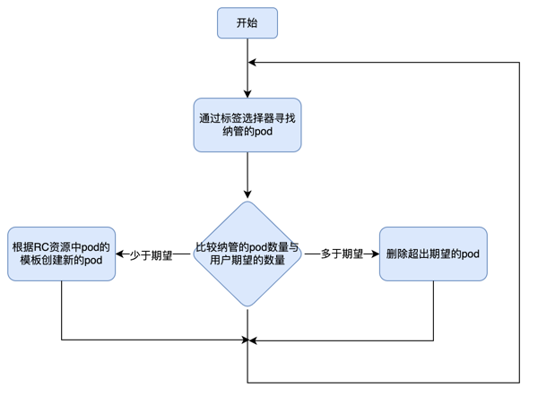
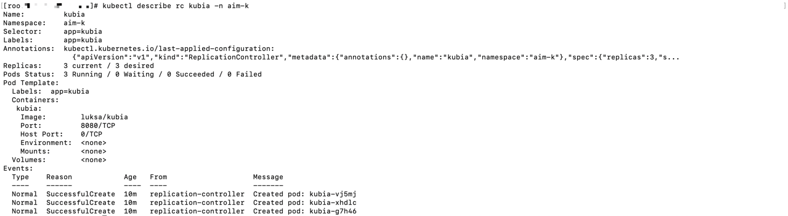

# 副本机制和其他控制器
在上一节介绍了pod的基本操作，如何去创建、删除、更新pod。pod作为Kubernetes中最基本的部署单元，通常不会直接创建pod。因为如果pod由于某些意外
原因停止运行后并不会自动创建新pod运行应用，例如pod被调度到某个节点，由于节点故障导致节点上所有pod丢失，如果pod是直接创建，则不会在其他可用
节点上重新运行。那如何才能让Kubernetes集群在pod意外停止后，能重新创建pod运行应用呢？通常会通过ReplicationController、ReplicaSet、Deployment
等资源来管理pod的创建及维持pod的持续运行

## 存活探针
当通过ReplicationController、ReplicaSet、Deployment等资源来管理pod时，如果pod中容器主应用进程发生故障退出，或者节点丢失，pod异常终止。
kubernetes集群能够重新调度pod并运行，也就是说你的应用程序没有做任何自启动的事情，但kubernetes却能够让你的应用具有自我恢复运行的能力，保证
其高可用。但是如果应用主进程没有退出，一直运行，但由于某些原因其功能有问题无法对外提供服务，这个时候kubernetes无法知晓，也无法重新部署新的pod，
如果我们需要能让kubernetes能针对pod中应用程序的某些具体错误，做出反应，则需要借助于探针

Kubernetes可以通过存活探针检查容器是否还在运行，可以为pod中的每个容器指定单独的存活探针，当探测失败时，Kubernetes会定期执行探针并重启容器

Kubernetes有三种探测容器的机制

- HTTP GET探针对容器的IP地址执行HTTP GET请求。如果探测器收到成功响应的状态码，即收到HTTP响应状态码是2xx或3xx，则认为探测成功。如果返回错误
响应状态码或者根本没有响应，探测则认为是失败，容器将重新启动
  
- TCP套接字探针尝试与容器指定端口建立TCP连接。如果连接成功建立，则探测成功，否则探测失败重启容器

- Exec探针在容器内执行任何命令，并检查命令的退出状态码，如果状态码是0，则探测成功。所有其他状态码都认为失败

### 创建HTTP存活探针
在Pod资源描述文件中使用存活探针
```
apiVersion: v1
kind: Pod
metadata:
  name: kubia-liveness
spec:
  containers:
  - image: luksa/kubia-unhealthy
    name: kubia
    livenessProbe:
      httpGet:
        path: /
        port: 8080
```
- livenessProde：定义一个存活探针

- httpGet：指定使用httpGet探测端口8080，判断容器是否健康，这些请求会在容器运行后立即开始

- 上述镜像会在被请求5次之后，返回HTTP状态码500，Kubernetes会认为探测失败重启容器

### 存活探针使用
通过如下命令查看pod的信息
```
kubectl get pod kubia-liveness -n 命名空间
```
- RESTARTS：此列展示pod的重启次数，正常容器运行没有重启过此值为0。这里运行的pod此值会不断增加

- STATUS：显示pod状态，Running表示正常运行

- READY：就绪容器数与总容器数比列

当pod重启后，通过kubectl log指令获取的是重启后pod中容器的日志，如果想要查看重启前的pod中容器是为什么停止的，可以添加--previous参数
```
kubectl logs pod名称 -n 命名空间 --previous
```

也可以通过kubectl describe命令查看pod描述信息了解pod是因为什么原因重启
```
kubectl describe pod pod名称 -n 命名空间名称
```
上述指令会返回pod的详细信息，包括容器的镜像端口、状态、上次容器失败的原因、事件等信息。可以看到pod中容器上次退出的代码为137，137由128+x这两个数字
相加所得，x是终止信号编码，这里x为9，即SIGKILL的信号编码，表示容器进程被强制终止。当容器被强制终止，会创建一个全新的容器

### 配置存活探针的附加属性
上面配置的存活探针比较简单。在配置存活探针的时候，还可以配置其他辅助属性
```
apiVersion: v1
kind: Pod
metadata:
  name: kubia-liveness
spec:
  containers:
  - image: luksa/kubia-unhealthy
    name: kubia
    livenessProbe:
      httpGet:
        path: /
        port: 8080
      initialDelaySeconds: 0
      timeoutSeconds: 1
      periodSeconds: 10
      failureThreshold: 3
      successThreshold: 1
```
- initialDelaySeconds：指定初始等待时间，默认是0，即立即执行存活探测，但很多应用从启动到能正常提供服务需要一段时间，因此立即探测往往都会
失败，设施合理的初始等待时间是必要的。但应用的启动时间通常是不一定的，因此可以设置的稍大一些
  
- timeoutSeconds：超时时间，默认为1秒。如何探测在1秒内没有正确响应，则认为探测失败

- periodSeconds：探测周期，默认10秒，每10秒探测一次

- failureThreshold：连续探测多少次失败需要重启pod，默认3次

- successThreshold：连续探测多少次成功需要重启pod，默认1次

正确设置存活探针很重要，如果存活探针设置的不恰当会导致pod无法启动，会一直循环重启。因此对于有存活探针的pod,需要确保存活探针设置的正确合理

### 有效的存活探针是高可用的保障
对于生产环境中的pod，最好配置存活探针。没有存活探针，集群无法判断pod是否能正常提供服务，只要容器进程存在就认为是健康的pod，但很多时候可能
由于配置问题，pod中的容器应用无法对外提供服务，但通过命令查看pod却是处于就绪状态，如果有存活探针，能让我们更快的发现问题

简单的存活探针，仅仅检查服务能否响应，这样的存活探针虽然简单，但也能适应很多场景。但为了更好的检查应用是否存活，最好应用内部提供一个/health
的url接口，检查应用各重要组件是否正常工作，但此检查接口不能消耗太多计算资源，因为每个pod通常都会指定计算资源、内存资源的限制，如果探针需要
消耗太多资源将会影响应用的正常服务，并且通常存活探针执行都比较频繁

存活探针中无需实现循环逻辑，因为存活探针本身就是循环周期性执行，并且对于判定pod不可用本身就是会需要连续多次探测失败才判定pod不能正常运行

在判定pod不能正常提供服务后，集群将会重新启动新的pod替换不能正常运行的pod，而这些操作都是由pod运行节点上的kubelet完成，主服务器上的Kubernetes
Control Plane组件并不会参与。但如果节点崩溃了，Control Plane必须为所有异常终止的pod创建新的pod，但对于我们直接创建的pod则不在管理范围内，
因此不要直接创建pod，而是要通过RS、RC、Deployment、DaemonSet、StatefulSet等资源来管理pod

## ReplicationController
ReplicationController（简称RC）是Kubernetes中用于管理pod的资源。当通过RC资源部署pod时，会启动监听被RC管理的pod的状态，当pod意外丢失后，
RC资源能够感知到，并启动新的pod保持用户设置的期望副本数。但对于用户直接手动部署的pod，意外丢失或者退出后，不会再创建新的pod。

当减少RC期望的副本数或者手动创建相同标签的pod或者修改现有pod的标签，RC能够减少pod数，以保持pod在用户期望的副本数。RC通过标签选择器确定pod
是否为其纳管的pod

### RC控制协调流程
RC保持pod数与用户期望pod数一致的协调流程如下


### RC的三部分
RC资源有三个主要部分

- selector：标签选择器，用于确定RC资源纳管的pod

- replicas：副本数，指定期望的副本数量

- template：pod模板，用于创建pod

上面三部分信息都可以随意修改。但除了修改副本数，其余两部分的修改并不会对已经创建的pod造成影响

- 当把期望pod数降低会删除已经创建的pod 
- 当更改标签选择器，会让已经创建的pod脱离RC的纳管范围，不再受RC管理，但并不影响已经创建的pod，RC会发现其纳管的pod数少于期望pod数，将使用模板创建新的pod，
以达到期望数量
- 当修改pod模板内容，不会影响已经创建的pod，也不会创建出新的pod，只有当RC纳管的pod数量少于期望数量时，才会用新的pod模板创建出pod

RC为我们提供了如下的强大功能

- 确保pod始终按用户期望的副本数运行，当pod丢失时能及时创建新的pod

- 当节点故障，导致RC下纳管pod丢失时，能及时在其它节点上创建新pod补齐

- 用户可以通过调节期望的副本数，实现服务的水平伸缩

### 使用RC
下面是一个RC资源的描述文件
```
cat <<EOF> kubia-rc.yaml
apiVersion: v1
kind: ReplicationController
metadata:
  name: kubia
spec:
  replicas: 3
  selector:
    app: kubia
  template:
    metadata:
      labels:
        app: kubia
    spec:
      containers:
      - name: kubia
        image: luksa/kubia
        ports:
        - containerPort: 8080
EOF

# 执行如下指令使用描述文件创建RC资源
kubectl apply -f kubia-rc.yaml
```
- 首先会创建名为kubia的RC资源，它会确保标签选择器匹配到的所有包含app=kubia标签的pod始终是三个

- 使用template中定义的pod模板来创建pod。pod模板中的标签必须包含RC标签选择器中的标签，否则API校验无法通过。当然也可以不用指定RC的标签选择器，
但必须给出pod模板的标签，创建RC资源时会自动将pod模板中的标签作为标签选择器的标签
  
运行如下命令验证是否已经创建三个新的pod
```
kubectl get pods -n 命名空间
```

当手动删除一个pod后，ReplicationController会立即创建一个新的pod，使pod数量保持期望副本数
```
kubectl delete pod pod名称 -n 命名空间
```

通过get指令获取ReplicationController的简要信息
```
kubectl get rc -n 命名空间
```
- rc为ReplicationController的简称

- DESIRED列：显示期望副本数

- CURRENT：显示当前已有副本数
  
- READY：显示已就绪副本数

使用describe命令查看详细信息
```
kubectl describe rc rc名称 -n 命名空间
```


- Replicas：实际pod数/期望副本数

- Pods Status：显示各状态pod数量

- Events：显示此rc资源相关的事件

在多节点K8s集群中，当某个节点不可访问，例如网络断开，节点将变成NotReady状态，对于故障节点上使用RC管理的pod，其状态并不会立即变化，因为可能
是由于节点临时不可访问或者节点重启，但如果过了几分钟所在节点依然无法访问，则其上的pod状态将被设置为Unknown，RC资源将创建新的pod保持期望副本。
故障节点恢复重新接入集群后，其上状态为Unknown的pod将被清理掉

RC并没有将pod与其强绑定，而是通过标签选择器确定其下管理的pod，pod中只要包含与RC标签选择器中一样的标签就认为是由该RC资源管理。也就是说，在
受RC管理的pod中添加新标签并不会导致pod不受RC管理。执行如下指令向pod添加新标签
```
# 添加标签type=test
kubectl label pod pod名称 type=test -n 命名空间

# 获取pod列表并展示标签列
kubectl get pods --show-labels
```

删除或修改pod中与RC标签选择器匹配的标签，将导致pod脱离当前RC，如果其标签与其他RC资源的标签选择器标签匹配，则pod将被其他RC管理。如果不与任何
RC标签选择器标签匹配，则将与手工创建pod一样。运行如下指令修改pod标签
```
kubectl label pod pod名称 app=food --overwrite -n 命名空间
```
- 修改pod标签app值为food，需要添加--overwrite参数，否则不会更改，避免添加标签时无意覆盖已有标签值

- 执行指令之后被修改标签pod将不再受rc资源管理，为满足期望副本数将重新创建一个新的pod

### 修改rc资源
rc资源的pod模板可以随时修改，修改pod模板后不会影响已经创建好的pod，只会导致之后创建的pod按新的模板生成，例如修改pod标签，或者修改镜像版本等。
如下指令修改rc中pod模板
```
// 查看命名空间下rc资源列表
kubectl get rc -n 命名空间

// 修改rc资源内容
kubectl edit rc rc资源名称 -n 命名空间
```
- 修改完rc资源的pod模板后，再列出pod列表，可以发现pod并没有发生任何变化

- 删除rc资源下的某个pod，查看新创建的pod，可以发现修改在新pod上生效了

除了修改rc的pod模板，也可以修改其期望副本数据，对pod进行水平伸缩。除了直接修改rc资源期望副本数进行水平伸缩，可以通过scale指令对pod进行水平伸缩
```
kubectl scale rc kubia --replicas=4 -n 命名空间
```
- 将rc期望副本数调整为4，scale本质还是去更新rc资源描述文件的期望副本数字段值

### 删除rc
使用kubectl delete可以删除k8s中的rc资源，当rc资源被删除时，其管理的pod资源也会被删除。但有些时候不希望删除其下管理的pod，例如之前使用rc
资源部署应用，但后面想使用rs资源来管理pod，这时并不需要将所有应用删除之后再使用rs运行应用，可以在不影响应用运行下只删除rc资源。运行如下指令
删除rc资源并且不删除其下的pod
```
kubectl delete rc rc资源名称 --cascade=false -n 命名空间名称
```
- 在删除rc资源时设置cascade为false将不会级联删除其下管理的pod

- 查看pod列表，可以发现pod依然在运行，不会对应用造成影响

## ReplicaSet
rc资源是k8s早期提供的资源，也是早期唯一用于复制和在节点故障时重新调度节点的资源，之后出现了rc资源的升级版ReplicaSet资源。rc资源将在新版本中
渐渐弃用。但在正常使用时也不会直接创建rs（ReplicaSet简称）资源，而是使用Deployment资源，Deployment资源提供了更多高级特性

### rs 对比 rc


## 每个节点上运行一个pod
pod执行系统级别的与基础结构相关的操作，比如希望在每个节点上运行日志收集器和资源监控器时需要每个节点上都运行一个这样的pod

### 使用DaemonSet在每个节点上运行一个pod
DaemonSet对象没有期望副本数的概念，它的工作是确保一个pod匹配它的选择器并在每个节点上运行，DaemonSet创建的pod，已经有一个指定的目标节点并跳过Kubernetes调度器，不是随机分配在集群上。

### 使用DaemonSet在特定节点上运行pod
DaemonSet可以通过在pod模板中的nodeSelector属性指定pod要运行的节点，即使节点设置为不可调度，因为DaemonSet管理的pod完全绕过调度器。

#### 创建DaemonSet
1. 创建一个DaemonSet YAML文件
```yaml
    apiVersion: apps/v1beta2 #DaemonSet在apps的API组中，版本是v1beta2
    kind: DaemonSet          #定义类型
    metadata:
        name: ssd-monitor    #DaemonSet名
    spec:
        selector:
            matchLabels:
                app: ssd-monitor  #定义匹配pod标签选择器
        template:
            metadata:
                labels:
                    app: ssd-monitor #pod标签
            spec:
                nodeSelector:
                    disk: ssd   #节点选择器
                containers:
                -   name: main  #容器名
                    image: luksa/ssd-monitor #指定pod运行镜像
```
2. 创建DaemonSet
```
    kubectl create -f ssd-monitor-daemonset.yaml
```
3. 查看创建的DaemonSet
```
    kubectl get ds
```
#### 节点添加标签
1. 查询所有节点
```
    kubectl get nods
```
2. 给节点添加标签
```
    kubectl label node 节点名 disk=ssd
```
3. 查看DaemonSet在节点上创建pod
```
    kubectl get po
```
4. 修改节点标签
```
    kubectl label node 节点名 disk=hdd --overwrite
```
5. DaemonSet将从该节点终止pod
```
    kubectl get po
```
## 执行单个任务的pod
在一个可完成任务中，进程终止后，不应该再重新启动，不同于ReplicationController、ReplicaSet和DaemonSet会持续运行任务，没有完成状态。

### Job资源简介
Kubernetes通过Job资源提供了对可完成任务的支持。Job资源允许你运行一种pod，该pod在内部进程成功结束时，不重启容器，一旦任务完成，pod就被认为处于完成状态。如果节点发生故障，Job管理的pod将按照ReplicaSet的pod方式重新安排在其他节点上，如果该进程本身异常退出，可以将pod配置为重新启动容器。

### 定义Job资源
```yaml
    apiVersion: batch/v1    #Job属于batch API组，版本为v1
    kind: Job
    metadata:
        name: batch-job
    spec:
        template:
            metadata:
                labels: 
                    app: batch-job  #指定pod标签（没有指定pod选择器将根据pod模板中的标签创建）
            spec:
                restartPolicy: OnFailure #Job不能使用Always为默认的重新启动策略
                containers:
                -   name: main
                    image: luksa/batch-job
```
pod通过restartPolicy指定进程结束是Kubernetes会做什么，默认为Always。对于Job资源需明确将重启策略设置为OnFailure或Never
### 查看Job运行pod
1. 创建Job
```
    kubectl create -f exporter.yaml
```
2. 查看Job资源
```
    kubectl get jobs
```
3. 查看pod状态
```
    kubectl get po
```
pod执行完任务之后将会标记为完成不在出现在pod列表中，可通过--show-all（或-a）查看所有pod
4. 查看执行完成Job日志
```
    kubectl logs pod名
```

### 在Job中运行多个pod实例
Job可以创建多个pod实例，并以并行或串行方式运行

#### 顺序运行pod
需要一个Job运行多次，则可以将completions设置为你希望作业的pod运行多少次
```yaml
    apiVersion: batch/v1
    kind: Job
    metadata:
        name: multi-completion-batch-job
    spec:
        completions: 5 #串行运行5个pod
        tempalte:
        ....
```
#### 并行运行Job pod
通过parallelism Job配置属性，指定允许多少个pod并行执行
```yaml
    apiVersion: batch/v1
    kind: Job
    metadata:
        name: multi-completion-batch-job
    spec:
        completions: 5
        parallelism: 2
        template:
        .....
```
#### Job的缩放
在Job运行时可以更改Job的parallelism属性让Job增加或减少pod
```
    kubectl scale job multi-completion-batch-job --replicas 3
```
#### 限制Job pod完成任务时间
通过activeDeadlineSeconds属性可以限制pod的时间，如果pod运行时间超过此时间，系统将尝试终止pod，并将Job标记为失败。spec.backoffLimit配置Job被标记为失败后重试次数，默认6次

### 定期运行或在将来运行一次pod
Kubernetes中的cron任务通过创建CronJob资源进行配置

#### 创建一个CronJob
```yaml
    apiVersion: batch/v1betal   #API组是batch，版本是v1beta1
    kind: CronJob                   
    metadata:
        name: batch-job-every-fifteen-minutes
    spec:
        schedule: "0,15,30,45 * * * *" #这项任务在每天每小时0、15、30和45分钟运行
        jobTemplate:
            spec:
                template:
                    metadata:
                        labels:
                            app: periodic-batch-job
                    spec:
                        restartPolicy: OnFailure
                        containers:
                        -   name: main
                            image: luksa/batch-job

```
#### 了解计划任务运行方式
在计划时间内，CronJob资源会创建Job资源，然后Job创建pod。可能存在Job或pod创建并运行相对较晚，可以通过startingDeadlineSeconds字段指定截止日期
```yaml
    apiVersion: batch/v1beta1
    kind: CronJob
    spec:
        schedule: "0,15,30,45 * * * *"
        startingDeadlineSeconds: 15 #pod最迟必须在预定时间后15秒开始运行
```
如果任务超过预定时间任务将不会运行，并将显示为Failed。CronJob总是为计划中配置的每个执行创建一个Job，但也可能会同时创建俩个Job，或根本不创建，因此你的任务应该是幂等的，确保下一个任务运行完成本应该由上一次（错过的）运行完成的任何工作