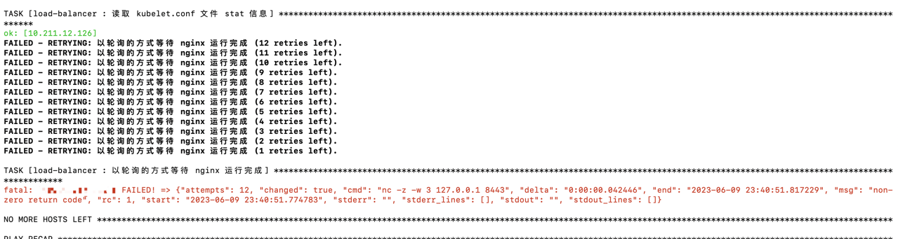
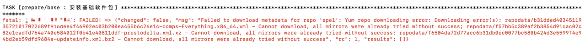
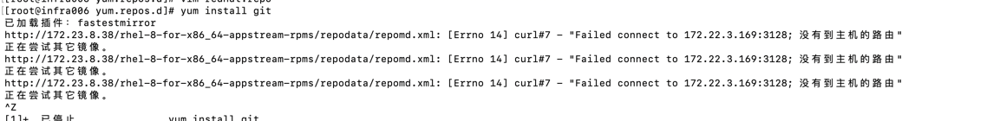
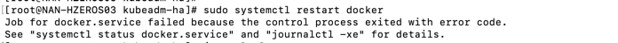
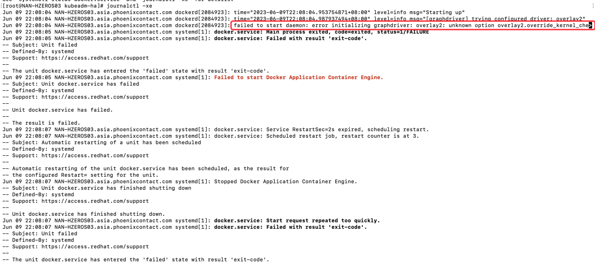
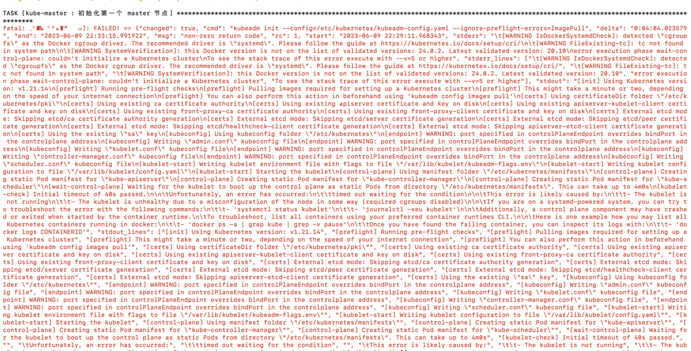

# K8S通过Ansible安装部署
K8S集群安装可参考https://gitee.com/open-hand/kubeadm-ha.git、https://github.com/easzlab/kubeasz.git

## 安装高可用集群
```
git clone https://gitee.com/open-hand/kubeadm-ha.git && cd kubeadm-ha
```

### 先安装ansible
在需要安装Kubernetes集群的任意节点上部署ansible工具。kubeadm-ha使用ansible进行集群安装
```
sudo ansible/install.sh
```
- 如果在Red Hat中运行可能会报类似***platform-python-devel Cannot download, all mirrors were already tried***。这时需要直接使用yum进行安装
  ```
   yum -y install platform-python-devel
  ```

### 升级内核,非必需，默认不升级，若需要升级执行如下命令
```
ansible-playbook -i example/hosts.m-master.ip.ini 00-kernel.yml
```

#### hosts.m-master.ip.ini
此文件为配置主机分组及必要变量。需要按需求维护各个分组的主机，例如etcd节点主机、master节点主机、工作节点主机等。ansible将根据配置的各个分组的
主机，安装对应分组的Kubernetes组件
```
; 将所有节点的信息在这里填写
;    第一个字段                  为节点内网IP，部署完成后为 kubernetes 节点 nodeName
;    第二个字段 ansible_port     为节点 sshd 监听端口
;    第三个字段 ansible_user     为节点远程登录用户名
;    第四个字段 ansible_ssh_pass 为节点远程登录用户密码
[all]
172.23.17.105 ansible_port=22 ansible_user="root" ansible_ssh_pass="sBzrmwcJwjGLXu&P"

; 私有云：
;    VIP 负载模式：
;       也就是负载均衡器 + keepalived 模式，比如常用的 haproxy + keepalived。
;       本脚本中负载均衡器有 nginx、openresty、haproxy、envoy 可供选择，设置 lb_mode 即可进行任意切换。
;       设置 lb_kube_apiserver_ip 即表示启用 keepalived，请先与服务器提供部门协商保留一个IP作为 lb_kube_apiserver_ip，
;       一般 lb 节点组中有两个节点就够了，lb节点组中第一个节点为 keepalived 的 master 节点，剩下的都为 backed 节点。
;
;    节点本地负载模式：
;       只启动负载均衡器，不启用 keepalived（即不设置 lb_kube_apiserver_ip），
;       此时 kubelet 链接 apiserver 地址为 127.0.0.1:lb_kube_apiserver_port。
;       使用此模式时请将 lb 节点组置空。
;
; 公有云：
;    不推荐使用 slb 模式，建议直接使用节点本地负载模式。
;    若使用 slb 模式，请先使用节点本地负载模式进行部署，
;    部署成功后再切换至 slb 模式：
;       将 lb_mode 修改为 slb，将 lb_kube_apiserver_ip 设置为购买到的 slb 内网ip，
;       修改 lb_kube_apiserver_port 为 slb 监听端口。
;    再次运行初始化集群脚本即可切换至 slb 模式。
[lb]

; 注意etcd集群必须是1,3,5,7...奇数个节点
[etcd]
172.23.17.105

[kube-master]
172.23.17.105

[kube-worker]
172.23.17.105

; 预留组，后续添加master节点使用
[new-master]

; 预留组，后续添加worker节点使用
[new-worker]

; 预留组，后续添加etcd节点使用
[new-etcd]

; 预留组，后续删除worker角色使用
[del-worker]

; 预留组，后续删除master角色使用
[del-master]

; 预留组，后续删除etcd角色使用
[del-etcd]

; 预留组，后续删除节点使用
[del-node]

;-------------------------------------- 以下为基础信息配置 ------------------------------------;
[all:vars]
; 是否跳过节点物理资源校验，Master节点要求2c2g以上，Worker节点要求2c4g以上
skip_verify_node=false
; kubernetes版本
kube_version="1.21.14"

; 容器运行时类型，可选项：containerd，docker；默认 containerd
container_manager="containerd"

; 负载均衡器
;   有 nginx、openresty、haproxy、envoy  和 slb 可选，默认使用 nginx
lb_mode="nginx"
; 使用负载均衡后集群 apiserver ip，设置 lb_kube_apiserver_ip 变量，则启用负载均衡器 + keepalived
; lb_kube_apiserver_ip="192.168.56.15"
; 使用负载均衡后集群 apiserver port
lb_kube_apiserver_port="8443"

; 网段选择：pod 和 service 的网段不能与服务器网段重叠，
; 若有重叠请配置 `kube_pod_subnet` 和 `kube_service_subnet` 变量设置 pod 和 service 的网段，示例参考：
;    如果服务器网段为：10.0.0.1/8
;       pod 网段可设置为：192.168.0.0/18
;       service 网段可设置为 192.168.64.0/18
;    如果服务器网段为：172.16.0.1/12
;       pod 网段可设置为：10.244.0.0/18
;       service 网段可设置为 10.244.64.0/18
;    如果服务器网段为：192.168.0.1/16
;       pod 网段可设置为：10.244.0.0/18
;       service 网段可设置为 10.244.64.0/18
; 集群pod ip段，默认掩码位 18 即 16384 个ip
kube_pod_subnet="10.244.0.0/18"
; 集群service ip段
kube_service_subnet="10.244.64.0/18"
; 分配给节点的 pod 子网掩码位，默认为 24 即 256 个ip，故使用这些默认值可以纳管 16384/256=64 个节点。
kube_network_node_prefix="24"

; node节点最大 pod 数。数量与分配给节点的 pod 子网有关，ip 数应大于 pod 数。
; https://cloud.google.com/kubernetes-engine/docs/how-to/flexible-pod-cidr
kube_max_pods="110"

; 集群网络插件，目前支持flannel,calico
network_plugin="calico"

; 若服务器磁盘分为系统盘与数据盘，请修改以下路径至数据盘自定义的目录。
; Kubelet 根目录
kubelet_root_dir="/var/lib/kubelet"
; docker容器存储目录
docker_storage_dir="/var/lib/docker"
; containerd容器存储目录
containerd_storage_dir="/var/lib/containerd"
; Etcd 数据根目录
etcd_data_dir="/var/lib/etcd"
```

- 注意最后设置安装kubelet、docker、etcd、containerd路径配置，需要根据需求规划好目录，分配充足的磁盘空间，否则当磁盘紧张时会自定在节点上打上
磁盘压力污点，没有容忍此污点的pod将不能调度到此节点
  
#### 00-kernel.yml
```
# 升级所有节点内核
- hosts: all
  gather_facts: false
  tasks:
    - name: "设置代理服务器环境变量"
      set_fact:
        proxy_env:
          http_proxy: "{{ http_proxy | default ('') }}"
          HTTP_PROXY: "{{ http_proxy | default ('') }}"
          https_proxy: "{{ https_proxy | default ('') }}"
          HTTPS_PROXY: "{{ https_proxy | default ('') }}"
          no_proxy: "{{ no_proxy | default ('') }}"
          NO_PROXY: "{{ no_proxy | default ('') }}"
      no_log: true

- hosts: 
  - all
  roles:
  - prepare/variables
  - prepare/base
  - prepare/kernel
  environment: "{{ proxy_env }}"
```

- set_fact：用于在tasks模块中定义变量

- environment：用于设置环境变量

- roles：将会执行roles目录下指定目录的tasks

    - variables: 设置变量，可在roles/prepare/variables/defaults/main.yml编辑修改
    
    - base: 完成变量校验、节点校验、完成基础软件安装。main.yml可以查看task的执行流程
    
    - kernel：升级系统内核。main.yml可以查看task的执行流程
  
### 未安装Docker主机安装高可用Kubernetes集群
执行如下指令
```
ansible-playbook -i example/hosts.m-master.ip.ini 90-init-cluster.yml
```
- 如果报***Module nf_conntrack_ipv4 not found***，可以忽略

- 如果在Red Hat中安装时报容器安装相关的错误，可以尝试运行如下指令后重新执行上述指令进行安装。需要注意的是下面指令会将安装的docker卸载
  ```
   sudo yum remove docker \
                  docker-client \
                  docker-client-latest \
                  docker-common \
                  docker-latest \
                  docker-latest-logrotate \
                  docker-logrotate \
                  docker-engine \
                  podman \
                  runc
  ```

### 已安装Docker安装高可用Kubernetes集群
对于已安装docker并且已经部署服务的主机也可以使用kubeadm-ha来安装Kubernetes集群，但需要注意docker配置、docker版本、端口占用等问题

#### 检查端口占用
kubernetes集群部署需要占用端口，对于已经安装docker、自己应用的主机需要先检查端口是否被占用，如果端口被占用将会导致对应安装组件无法运行
[查看文档了解需要使用到的端口](https://gitee.com/open-hand/kubeadm-ha/blob/release-1.21/docs/00-%E5%AE%89%E8%A3%85%E9%A1%BB%E7%9F%A5.md)

#### 添加kubernetes yum源
添加/etc/yum.repos.d/kubernetes.repo文件，配置kubernetes yum源，内容如下
```
[kubernetes]
baseurl = https://mirrors.aliyun.com/kubernetes/yum/repos/kubernetes-el7-x86_64/
enabled = 0
gpgcheck = 0
name = Kubernetes
```

#### 检查已安装docker版本
安装Kubernetes集群不同版本对docker版本也有要求，如果docker版本不在Kubernetes版本支持范围会报如下错误


如果不在支持范围，并且docker中已经运行了应用不能卸载，则需要对docker进行升级或降级

##### yum对docker进行升级到指定版本
```
# 查看docker-ce版本列表
yum list docker-ce --showduplicates

# 查看docker-ce-cli版本列表
yum list docker-ce-cli --showduplicates

# 选取需要的版本进行升级
yum update -y docker-ce-20.10.21-3.el8 docker-ce-cli-20.10.21-3.el8
```

##### yum对docker进行降级到指定版本
```
# 查看docker-ce版本列表
yum list docker-ce --showduplicates

# 查看docker-ce-cli版本列表
yum list docker-ce-cli --showduplicates

# 将docker降到指定版本
yum downgrade --setopt=obsoletes=0 -y docker-ce-20.10.21-3.el8 docker-ce-cli-20.10.21-3.el8
```

如果从24.0.2-1.el8版本降到20.10.21-3.el8版本则会报如下错误


需要使用如下指令将冲突包docker-buildx-plugin卸载,然后再执行降级指令
```
yum remove docker-buildx-plugin -y
```

#### 修改docker cgroup driver
修改/etc/docker/daemon.json文件内容指定cgroupdriver为systemd，如果不指定默认是使用cgroupfs。并且指定docker拉取镜像仓库，默认是使用dockerhub的公共镜像库比较慢。
如果在你主机上不存在该文件就创建一个
```
{
  "log-driver": "json-file",
  "log-opts": {
    "max-size": "100m"
  },
  "exec-opts": ["native.cgroupdriver=systemd"],
  "registry-mirrors": [
        "http://hub-mirror.c.163.com"
  ],
  "bip": "172.17.10.1/16",
  "data-root": "/u01/data/docker"
}
```

更新完daemon.json文件后运行下面指令使配置生效
```
sudo systemctl daemon-reload

sudo systemctl restart docker
```
- 如果启动docker失败则可以运行journalctl -xe查看详情，首先考虑daemon.json内容是否正确

注意不要使用命令sed -i "s#^ExecStart=/usr/bin/dockerd.*#ExecStart=/usr/bin/dockerd -H fd:// 
--containerd=/run/containerd/containerd.sock --exec-opt native.cgroupdriver=systemd#g" 
/usr/lib/systemd/system/docker.service更新cgroupdriver，如果使用上述指令更新导致docker无法启动，可能是因为/usr/lib/systemd/system/docker.service中
--exec-opt native.cgroupdriver=systemd配置与daemon.json文件中"exec-opts": ["native.cgroupdriver=systemd"]冲突，可以去除/usr/lib/systemd/system/docker.service中
--exec-opt native.cgroupdriver=systemd配置

#### 执行部署Kubernetes集群
执行如下指令
```
ansible-playbook -i example/hosts.s-master.ip.ini 90-init-cluster.yml
```

##### nginx运行失败

- 上述错误是nginx运行失败造成的，运行失败的原因大概率是端口占用导致

运行如下命令，查看运行失败的容器
```
docker ps -a
```


查看k8s_lb-nginx_lb-nginx容器日志，查看具体原因
```
docker logs -f 94fbc47c047e
```


- 可以看到错误原因是8081端口占用导致

##### yum基础软件包报错


尝试执行如下指令
```
yum clean all && yum update
```
- 注意yum update会更新yum安装组件的版本到最新，慎用

如果设置了yum代理服务可能会报如下错误

- 此错误是设置了代理服务器，可以通过/etc/yum.conf调整代理或去除代理

##### docker停止运行执行安装报错

- 当前节点已安装docker，但报错确是crictl pull拉取镜像，而不是docker pull。检查发现docker未正常运行

首先尝试如下命令
```
sudo systemctl daemon-reload

sudo systemctl restart docker
```
得到如下报错

- 从报错可以发现并没有说明具体报错原因，可以按提示尝试执行systemctl status docker.service或journalctl -xe查看有价值信息

执行如下指令查看docker重启失败详细信息
```
journalctl -xe
```
得到如下详情信息

- 从报错可以看出，overlay2配置问题导致的，将overlay2配置从/etc/docker/daemon.json中移除。如果docker启动不了大概率是/etc/docker/daemon.json配置有问题

##### 初始化master失败

首先需要查看具体报错信息，报错信息通常会反馈是容器cgroup driver驱动配置，还是某个地址访问不通例如127.0.0.1:8443: connect: connection refused。
如果反馈信息不能判断问题可以尝试在对应节点执行手工执行命名并添加--v=5查看具体原因
```
kubeadm init --config=/etc/kubernetes/kubeadm-config.yaml --ignore-preflight-errors=ImagePull --v=5
```
- cgroup driver驱动配置问题：按上面配置cgroup driver

- 某个地址访问不通：查看对应端口组件是否正常运行，大概率是端口被占用了

##### 把问题排查完之后清理残留文件重新执行
在处理好部署报错问题后，需要将安装失败时残留的服务、文件清理干净，以免引发新的问题。执行如下命令完成文件清理
```
kubeadm reset -f
modprobe -r ipip
rm -rf ~/.kube/
rm -rf /etc/kubernetes/
rm -rf /etc/systemd/system/kubelet.service.d
rm -rf /etc/systemd/system/kubelet.service
rm -rf /usr/bin/kube*
rm -rf /etc/cni
rm -rf /opt/cni
rm -rf /var/lib/etcd
rm -rf /var/etcd
yum clean all
yum remove kube*
```

### 解析

#### 90-init-cluster.yml
```
# 校验节点软件系统及硬件系统、安装必要基础组件、docker、kubeadm、kubelet、kubectl
- hosts: 
  - all
  gather_facts: false
  tasks:
    - name: "设置代理服务器环境变量"
      set_fact:
        proxy_env:
          http_proxy: "{{ http_proxy | default ('') }}"
          HTTP_PROXY: "{{ http_proxy | default ('') }}"
          https_proxy: "{{ https_proxy | default ('') }}"
          HTTPS_PROXY: "{{ https_proxy | default ('') }}"
          no_proxy: "{{ no_proxy | default ('') }}"
          NO_PROXY: "{{ no_proxy | default ('') }}"
      no_log: true

- hosts: 
  - all
  roles:
  - prepare/variables
  - prepare/base
  - prepare/container-engine
  - prepare/kubernetes
  environment: "{{ proxy_env }}"

# 进行 apiserver 负载均衡
- hosts: 
  - all
  roles:
  - prepare/variables
  - load-balancer

- hosts: 
  - all
  roles:
  - prepare/variables
  - chrony

# 安装 etcd，并分发etcd证书到master节点
- hosts: 
  - etcd
  - new-etcd
  - kube-master
  - new-master
  roles:
  - prepare/variables
  - etcd/certificates
  - etcd/install

# 生成 kubernetes 所需证书证书
- hosts: 
  - kube-master
  - new-master
  - kube-worker
  - new-worker
  roles:
  - prepare/variables
  - kube-certificates

# 初始化master节点
- hosts: 
  - kube-master
  - new-master
  roles:
  - prepare/variables
  - kube-master

# 初始化worker节点
- hosts: 
  - kube-worker
  - new-worker
  roles:
  - prepare/variables
  - kube-worker

# 标记各节点角色
- hosts: 
  - kube-master
  - kube-worker
  - new-master
  - new-worker
  roles:
  - prepare/variables
  - post

# 安装基础插件
- hosts: 
  - kube-master[0]
  roles:
  - prepare/variables
  - plugins/network-plugins
  - plugins/ingress-controller
  - plugins/metrics-server
  - plugins/kubernetes-dashboard
  - plugins/cert-manager
```

##### 执行roles/prepare/container-engine

tasks目录下main.yml文件说明了执行的流程
```
- name: 判断 Docker 是否早已安装
  shell: >
    systemctl status docker | grep running || echo "not running"
  register: docker_already_running

- name: 判断 containerd 是否早已安装
  shell: >
    systemctl status containerd | grep running || echo "not running"
  register: containerd_already_running

- include_tasks: docker/main.yml
  when: 
  - container_manager == "docker"
  - '"active" not in docker_already_running.stdout'
  - '"active" not in containerd_already_running.stdout'

- include_tasks: containerd/main.yml
  when: 
  - container_manager == "containerd"
  - '"active" not in docker_already_running.stdout'
  - '"active" not in containerd_already_running.stdout'
```
- 首先获取docker、containerd服务的运行状态。systemctl status docker的输出作为grep running的输入。如果未运行则显示not running，并注册运行变量

- 根据container_manager及安装状态确定执行docker下任务，还是containerd下任务。when下多个条件列表是and关系。如果目标主机已经安装容器将不会再安装

###### docker/main.yml
```
# 系统基础软件环境
- include_tasks: centos.yml
  when: ansible_distribution in [ 'CentOS','OracleLinux','RedHat' ]

- include_tasks: debian.yml
  when: ansible_distribution in [ 'Ubuntu','Debian' ]

# 公共系统参数设置
- include_tasks: common.yml
```
- 根据不同操作系统执行对应操作系统安装

  - centos.yml
    ```
    - name: 添加 Docker yum 仓库
      yum_repository:
        name: docker-ce-stable
        file: docker-ce
        description: Docker CE Stable - $basearch
        baseurl: "{{ docker_yum_repo }}"
        enabled: no
        gpgcheck: no
        state: present
  
    - name: 安装 Docker
      yum:
        name:
        - "docker-ce-{{ docker_version }}.ce"
          state: present
          enablerepo: docker-ce-stable
      when: docker_version is version('18.09', '<')
    
    - name: 安装 Docker
      yum:
        name:
        - "docker-ce-{{ docker_version }}"
        - "docker-ce-cli-{{ docker_version }}"
        - "containerd.io-{{ containerd_version.split('-')[0] }}"
          state: present
          enablerepo: docker-ce-stable
      when: docker_version is version('18.09', '>=')
    ```
    - 通过yum_repository模块添加 Docker yum 仓库
      
      - name：必须参数，指定唯一的仓库ID，state为present或absent时需要设置name参数
    
      - file：用于设置仓库的配置文件名称，即设置”.repo”配置文件的文件名前缀，在不使用此参数的情况下，默认以 name 参数的仓库ID作为”.repo”配置文件的文件名前缀，同一个”.repo” 
        配置文件中可以存在多个yum源
        
      - description：仓库的注释信息
    
      - baseurl：yum仓库repodata目录的URL，可以是多个，如果设置为多个，需要使用"metalink"和"mirrorlist"参数
    
      - enabled：是否使用此yum仓库
    
      - gpgcheck：是否对软件包执行gpg签名检查
    
      - state：状态，默认的present为安装此yum仓库，absent为删除此yum仓库
        
    - 通过yum安装docker
    
      - 如果docker_version小于18.09，则执行docker-ce-{{ docker_version }}.ce安装
  
        ```
        - name: 安装 Docker
          yum:
          name:
          - "docker-ce-{{ docker_version }}.ce"
            state: present
            enablerepo: docker-ce-stable
            when: docker_version is version('18.09', '<')
        ```
        - enablerepo：启用源
    
        - state：状态（absent、installed、latest、present、removed）。present和installed将简单地确保安装所需的包；latest如果指定的程序包不是最新的可用版本，将更新该程序包；absent
        和removed将删除指定的程序包
        
        - name：要进行操作的软件包的名字，也可以传递一个url或者一个本地的rpm包的路径
    
      - 如果docker_version大于等于18.09，则执行docker-ce-{{ docker_version }}、docker-ce-cli-{{ docker_version }}、containerd.io-{{ containerd_version.split('-')[0] }}
    
        ```
          - name: 安装 Docker
            yum:
              name:
              - "docker-ce-{{ docker_version }}"
              - "docker-ce-cli-{{ docker_version }}"
              - "containerd.io-{{ containerd_version.split('-')[0] }}"
              state: present
              enablerepo: docker-ce-stable
            when: docker_version is version('18.09', '>=')
        ```
        
  - debian.yml
    
    ```
    - name: 生成 Docker GPG 公钥
      copy:
        src: docker.gpg
        dest: /tmp/docker.gpg
        owner: root
        mode: 0644
    
    - name: 添加 Docker GPG 公钥
      shell: apt-key add /tmp/docker.gpg
      
    - name: 添加 Docker apt 仓库
      apt_repository:
        repo: "{{ docker_apt_repo }}"
        state: present
      
    - name: 安装 Docker
      apt:
        name:
        - "docker-ce={{ docker_version }}~ce~3-0~{{ ansible_distribution | lower }}"
        state: present
        allow_unauthenticated: true
      when: docker_version is version('18.09', '<')
      
    - name: 安装 Docker
      apt:
        name:
        - "docker-ce=5:{{ docker_version }}~3-0~{{ ansible_distribution | lower }}-{{ ansible_distribution_release }}"
        - "docker-ce-cli=5:{{ docker_version }}~3-0~{{ ansible_distribution | lower }}-{{ ansible_distribution_release }}"
        - "containerd.io={{ containerd_version }}"
        state: present
        allow_unauthenticated: true
      when: docker_version is version('18.09', '>=')
    ```
    - 类似于centos.yml，完成docker安装
  
- common.yml。为安装的docker设置系统参数

  - 完成目录创建，如：{{ docker_storage_dir }} 存储目录
  
  - 设置docker开机自启动
  
  - 添加当前用户到Docker用户组

###### containerd/main.yml

类似于上述docker安装流程，根据不同操作系统，使用对应包管理工具执行containerd安装

```
# 系统基础软件环境
- include_tasks: centos.yml
  when: ansible_distribution in [ 'CentOS','OracleLinux','RedHat' ]

- include_tasks: debian.yml
  when: ansible_distribution in [ 'Ubuntu','Debian' ]

# 公共系统参数设置
- include_tasks: common.yml
```

##### 执行roles/prepare/kubernetes完成kubernetes安装

根据main.yml文件可知安装kubernetes流程，类似于docker安装流程

```
# 系统基础软件环境
- include_tasks: centos.yml
  when: ansible_distribution in [ 'CentOS','OracleLinux','RedHat' ]

- include_tasks: debian.yml
  when: ansible_distribution in [ 'Ubuntu','Debian' ]

- name: 配置 kubectl 命令行自动补全
  shell: kubectl completion bash > /usr/share/bash-completion/completions/kubectl
```

- 根据操作系统执行kubernetes安装

###### centos.yml
CentOS、OracleLinux、RedHat执行安装kubernetes流程如下

```
- name: 添加 Kubernetes yum 仓库
  yum_repository:
    name: kubernetes
    file: kubernetes
    description: Kubernetes
    baseurl: "{{ kubernetes_yum_repo }}"
    enabled: no
    gpgcheck: no
    state: present

- name: 安装 kubeadm kubelet kubectl
  yum:
    name: 
    - "kubectl-{{ kube_version }}"
    - "kubelet-{{ kube_version }}"
    - "kubeadm-{{ kube_version }}"
    state: present
    enablerepo: kubernetes
```
- 设置Kubernetes yum仓库

- 安装kubeadm kubelet kubectl

  - 用来初始化集群的指令
  
  - 在集群中的每个节点上用来启动 Pod 和容器等
  
  - 用来与集群通信的命令行工具

###### debian.yml
Ubuntu、Debian执行安装kubernetes流程如下

```
- name: 生成 Kubernetes GPG 公钥
  copy:
    src: kubernetes.gpg
    dest: /tmp/kubernetes.gpg
    owner: root
    mode: 0644

- name: 添加 Kubernetes GPG 公钥
  shell: apt-key add /tmp/kubernetes.gpg

- name: 添加 Kubernetes apt 仓库
  apt_repository:
    repo: "{{ kubernetes_apt_repo }}"
    state: present

- name: 安装 kubeadm kubelet kubectl
  apt: 
    name:
    - "kubectl={{ kube_version }}-00"
    - "kubelet={{ kube_version }}-00"
    - "kubeadm={{ kube_version }}-00"
    state: present
    allow_unauthenticated: true
```

- 类似于centos.yml安装流程，只是改为用apt包管理器安装

##### apiserver 负载均衡安装
```
- hosts: 
  - all
  roles:
  - prepare/variables
  - load-balancer
```

###### load-balancer
查看main.yml，了解安装流程

```
- include_tasks: external.yml
  when: lb_mode == "slb"

- include_tasks: internal.yml
  when: 
  - lb_mode != "slb"
  - (inventory_hostname in groups['lb']) or (groups['lb']|length == 0 and inventory_hostname in (groups['kube-master'] + groups['kube-worker'] + groups['new-master'] + groups['new-worker']))
```
- lb_mode：默认为nginx，支持nginx、openresty、haproxy、envoy、slb 

- 对于lb_mode为非slb类型，如果配置lb节点列表，则只在lb节点列表执行internal.
  yml任务；如果未配置，则在kube-master、kube-worker、new-master、new-worker下节点执行internal.yml任务
  
####### internal.yml
```
- name: 判断 Docker 是否早已安装
  shell: >
    systemctl status docker | grep running || echo "not running"
  register: docker_already_running

- name: 设置 container_manager_detected 变量
  set_fact:
    container_manager_detected: >-
      
      docker
      
      containerd
      

- name: 创建 load-balancer、kubelet 相关目录
  file: 
    name: "{{ item }}"
    state: directory
  with_items:
  - "{{ kubelet_root_dir }}"
  - /etc/kubernetes/manifests
  - /etc/kubernetes/plugins/lb-config
  - /etc/systemd/system/kubelet.service.d

- include_tasks: openresty.yml
  when: lb_mode == "openresty"

- include_tasks: nginx.yml
  when: lb_mode == "nginx"

- include_tasks: haproxy.yml
  when: lb_mode == "haproxy"

- include_tasks: envoy.yml
  when: lb_mode == "envoy"

- block:
  - name: keepalived | 获取网卡名称
    shell: "ip a|grep '{{ current_host_ip }}/'|awk '{print $NF}'"
    register: lb_keepalived_interface
  - name: keepalived | 拉取相关镜像
    shell: "{{ image_pull_command }} {{ item }}"
    with_items:
    - "{{ lb_keepalived_image }}"
  - name: keepalived | 生成 static pod 文件
    template: 
      src: keepalived.yaml.j2
      dest: /etc/kubernetes/manifests/lb-keepalived.yaml
      owner: root
      mode: 0644
  when: inventory_hostname in groups['lb']

- name: 读取 kubelet.conf 文件 stat 信息
  stat: 
    path: /etc/kubernetes/kubelet.conf
  register: kubelet_conf_stat

- block:
  - name: 获取 Docker Cgroup Driver 值
    shell: docker info --format '{{ '{{' }} json .CgroupDriver {{ '}}' }}' | cut -d'"' -f2
    register: docker_cgroup_driver
    when: container_manager_detected == 'docker'

  - name: 设置 docker 为容器运行时 kubelet_cgroup_driver_detected 变量
    set_fact:
      kubelet_cgroup_driver_detected: >-
        {{ docker_cgroup_driver.stdout }}
    when: container_manager_detected == 'docker'

  - name: 设置 containerd 为容器运行时 kubelet_cgroup_driver_detected 变量
    set_fact:
      kubelet_cgroup_driver_detected: >-
        systemdcgroupfs
    when: container_manager_detected == 'containerd'

  - name: 生成临时 kubelet unit 文件
    template: 
      src: 20-kubelet-override.conf.j2
      dest: /etc/systemd/system/kubelet.service.d/20-kubelet-override.conf
      owner: root
      mode: 0644

  - name: 重新加载 daemon
    systemd:
      daemon_reload: yes

  - name: 临时启动 kubelet 以引导 lb 运行
    service:
      name: kubelet
      state: restarted
      enabled: yes

  when: 
  - not kubelet_conf_stat.stat.exists

- name: 以轮询的方式等待 {{ lb_mode }} 运行完成
  shell: nc -z -w 3 127.0.0.1 {{ lb_kube_apiserver_port }}
  register: lb_status
  until: lb_status.rc == 0
  retries: 12
  delay: 5

- name: 以轮询的方式等待 keepalived 运行完成
  shell: nc -z -w 3 {{ kube_apiserver_ip | trim }} {{ lb_kube_apiserver_port }}
  register: keepalived_status
  until: keepalived_status.rc == 0
  retries: 12
  delay: 5
  when: inventory_hostname in groups['lb']

- block:
  - name: 移除临时 kubelet unit 文件
    file: 
      name: /etc/systemd/system/kubelet.service.d/20-kubelet-override.conf
      state: absent

  - name: 重新加载 daemon
    systemd:
      daemon_reload: yes

  - name: 停止临时启动 kubelet
    service:
      name: kubelet
      state: stopped
      enabled: yes
  when: 
  - not kubelet_conf_stat.stat.exists
  - inventory_hostname in (groups['kube-master'] + groups['kube-worker'] + groups['new-master'] + groups['new-worker'])
```
- 创建相关目录：kubelet_root_dir配置kubernetes使用根目录

- openresty.yml 
  openresty是一个功能比较全的应用服务器，是基于标准的nginx核心，可以扩展很多第三方模块，是中国人章亦春发起，不管大小厂都会有它的深度用户，
  web开发人员可以使用lua编程语言，对核心以及各种c模块进行编程，可以利用openresty快速搭建超1万并发高性能web应用系统
  ```
  - name: Openresty lb | 生成 openresty lb 配置文件
    template:
      src: openresty/openresty.conf.j2
      dest: /etc/kubernetes/plugins/lb-config/nginx.conf
      owner: root
      mode: 0644
    register: lb_configuration_result

  - name: Openresty lb | 拉取相关镜像
    shell: "{{ image_pull_command }} {{ item }}"
    with_items:
    - "{{ lb_openresty_image }}"
    - "{{ pod_infra_container_image }}"
  
  - name: Openresty lb | 生成 openresty lb static pod 文件
    template:
      src: openresty/openresty.yaml.j2
      dest: /etc/kubernetes/manifests/lb-kube-apiserver.yaml
      owner: root
      mode: 0644
  ```
  - 使用template模块将tasks目录同级templates目录下openresty/openresty.conf.j2输出到节点主机/etc/kubernetes/plugins/lb-config/nginx.conf中
  
  - 如果想了解更多ansible各个模块详细信息可以通过ansible-doc查看，例如 执行 ansible-doc template即可查看template模块详细配置及解释
  
  - 拉取Openresty镜像及pause镜像
    
  - 在Kubernetes中pause容器被当作Pod中所有容器的“父容器”，并为每个业务容器提供以下功能（关于pause大家可以看Kubernetes网络权威指南）
  
    - 在Pod中作为共享Linux namespace（Network、UTS等）的基础
  
    - 启用PID namespace共享，为Pod提供1号进程，并收集Pod内的僵尸进程
  
  - 将templates目录下openresty/openresty.yaml.j2输出到/etc/kubernetes/manifests/lb-kube-apiserver.yaml中
  
- nginx.yml
  ```
  - name: Nginx lb | 生成 nginx lb 配置文件
  template:
    src: nginx/nginx.conf.j2
    dest: /etc/kubernetes/plugins/lb-config/nginx.conf
    owner: root
    mode: 0644
  register: lb_configuration_result

  - name: Nginx lb | 拉取相关镜像
    shell: "{{ image_pull_command }} {{ item }}"
    with_items:
    - "{{ lb_nginx_image }}"
    - "{{ pod_infra_container_image }}"
  
  - name: Nginx lb | 生成 nginx lb static pod 文件
    template:
      src: nginx/nginx.yaml.j2
      dest: /etc/kubernetes/manifests/lb-kube-apiserver.yaml
      owner: root
      mode: 0644
  ```
  - 将templates目录下nginx/nginx.conf.j2输出到节点/etc/kubernetes/plugins/lb-config/nginx.conf中
  
  - 拉取nginx镜像和pause镜像
  
  - 将templates目录下nginx/nginx.yaml.j2输出到节点/etc/kubernetes/manifests/lb-kube-apiserver.yaml中

- haproxy.yml
  Haproxy 是一个使用C语言编写的自由及开放源代码软件，其提供高可用性、负载均衡，以及基于TCP和HTTP的应用程序代理。安装过程类似上面流程

  ```
  - name: Haproxy | 生成 haproxy 配置文件
  template: 
    src: haproxy/haproxy.cfg.j2 
    dest: /etc/kubernetes/plugins/lb-config/haproxy.cfg
    owner: root
    mode: 0644
  register: lb_configuration_result

  - name: Haproxy | 拉取相关镜像
    shell: "{{ image_pull_command }} {{ item }}"
    with_items:
    - "{{ lb_haproxy_image }}"
    - "{{ pod_infra_container_image }}"
  
  - name: Haproxy | 生成 haproxy static pod 文件
    template:
      src: haproxy/haproxy.yaml.j2
      dest: /etc/kubernetes/manifests/lb-kube-apiserver.yaml
      owner: root
      mode: 0644
  ```
  
- envoy.yml
  ```
  - name: Envoy lb | 生成 envoy lb 配置文件
  template:
    src: envoy/envoy.conf.yaml.j2
    dest: /etc/kubernetes/plugins/lb-config/envoy.yaml
    owner: root
    mode: 0644
  register: lb_configuration_result

  - name: Envoy lb | 拉取相关镜像
    shell: "{{ image_pull_command }} {{ item }}"
    with_items:
    - "{{ lb_envoy_image }}"
    - "{{ pod_infra_container_image }}"
  
  - name: Envoy lb | 生成 envoy lb static pod 文件
    template:
      src: envoy/envoy.yaml.j2
      dest: /etc/kubernetes/manifests/lb-kube-apiserver.yaml
      owner: root
      mode: 0644
  ```
  
- 当前节点在lb分组下主机中时，将会拉取keepalived镜像并设置

##### chrony

- kubernetes需要集群中的节点时间必须一致，可以使用chrony从网络同步时间

##### etcd
- etcd是一致且高可用的键值存储，用于kubernetes所有集群的后台数据库。具体介绍见https://kubernetes.io/zh-cn/docs/tasks/administer-cluster/configure-upgrade-etcd/

  - 运行的 etcd 集群个数成员为奇数
  
  - etcd 是一个 leader-based 分布式系统。确保主节点定期向所有从节点发送心跳，以保持集群稳定
  
  - 确保不发生资源不足。集群的性能和稳定性对网络和磁盘 I/O 非常敏感，任何资源匮乏都会导致心跳超时， 从而导致集群的不稳定。不稳定的情况表明没有选出任何主节点。 在这种情况下，集群不能对其当前状态进行任何更改，这意味着不能调度新的 Pod
  
  - 保持 etcd 集群的稳定对 Kubernetes 集群的稳定性至关重要。 因此，请在专用机器或隔离环境上运行 etcd 集群
  
  - 在生产中运行的 etcd 的最低推荐版本是 3.2.10+
  
  - 使用有限的资源运行 etcd 只适合测试目的。为了在生产中部署，需要先进的硬件配置
  
###### etcd/certificates

查看main.yml了解整个流程

```
- name: 在 etcd 节点创建 etcd 相关目录
  file: 
    name: /etc/kubernetes/pki/etcd
    state: directory
  when: inventory_hostname in (groups['etcd'] + groups['new-etcd'])

- name: 在 master 节点创建 etcd 证书相关目录
  file: 
    name: /etc/kubernetes/pki/etcd
    state: directory
  when: inventory_hostname in (groups['kube-master'] + groups['new-master'])

- block:
  # 获取密钥状态
  - include_tasks: certs_stat.yml
  # 生成证书
  - include_tasks: generate.yml
  when: inventory_hostname == groups['etcd'][0]

# 分发证书
- include_tasks: distribute.yml
```

- etcd、new-etcd分组下主机将创建/etc/kubernetes/pki/etcd目录

- kube-master、new-master分组下主机将创建etcd正式相关目录

- 在etcd组中第一个主机生成证书密钥

  - certs_stat.yml：查看etcd相关证书状况，并注册成变量
  
  - generate.yml：判断上一步注册的证书状况。如果证书已经存在则不做处理，如果不存在则创建证书
  
- distribute.yml
  ```
  # 分发证书
  - name: 获取 etcd 相关证书
    slurp:
      src: /etc/kubernetes/pki/etcd/{{ item }}
    with_items:
    - ca.crt
    - ca.key
    - healthcheck-client.crt
    - healthcheck-client.key
    - peer.crt
    - peer.key
    - server.crt
    - server.key
    register: etcd_certs
    delegate_to: "{{ groups['etcd'][0] }}"
    run_once: true
  
  - name: 分发 etcd 相关证书到 etcd 节点
    copy:
      dest: "{{ item.source }}"
      content: "{{ item.content | b64decode }}"
      owner: root
      group: root
      mode: 0644
    no_log: true
    with_items: "{{ etcd_certs.results }}"
    when:
    - inventory_hostname != groups['etcd'][0]
    - inventory_hostname in (groups['etcd'] + groups['new-etcd'])
  
  - name: 获取 apiserver etcd client 证书
    slurp:
      src: /etc/kubernetes/pki/{{ item }}
    with_items:
    - etcd/ca.crt
    - apiserver-etcd-client.crt
    - apiserver-etcd-client.key
    register: etcd_client_certs
    delegate_to: "{{ groups['etcd'][0] }}"
    run_once: true
  
  - name: 分发 apiserver etcd client 证书到 master 节点
    copy:
      dest: "{{ item.source }}"
      content: "{{ item.content | b64decode }}"
      owner: root
      group: root
      mode: 0644
    no_log: true
    with_items: "{{ etcd_client_certs.results }}"
    when:
    - inventory_hostname != groups['etcd'][0]
    - inventory_hostname in (groups['kube-master'] + groups['new-master'])
  ```
  - slurp模块配置从src指定文件路径拉取文件；delegate_to配置需要执行拉取的文件的主机，这里设置的是etcd分组的第一个组件，也就是创建各种证书的主机，并通过register将拉取的所有文件放入etcd_certs变量中
  
  - 将etcd_certs变量中的个证书复制到除etcd分组第一个节点之外的其它etcd分组节点上
  
  - 从etcd分组的第一个节点获取apiserver etcd client 证书，放入etcd_client_certs变量
  
  - 分发 apiserver etcd client 证书到 master 节点
  
###### etcd/install
查看main.yml，了解etcd安装流程

```
- name: 判断 Docker 是否早已安装
  shell: >
    systemctl status docker | grep running || echo "not running"
  register: docker_already_running

- name: 设置 container_manager_detected 变量
  set_fact:
    container_manager_detected: >-
      
      docker
      
      containerd
      

- name: 创建 kubelet 相关目录
  file: 
    name: "{{ item }}"
    state: directory
  with_items:
  - "{{ kubelet_root_dir }}"
  - /etc/systemd/system/kubelet.service.d

- block:
  - name: 在 etcd 节点创建 etcd 相关目录
    file: 
      name: "{{ item }}"
      state: directory
      owner: root
      group: root
      mode: 0700
    with_items:
    - "{{ etcd_data_dir }}"
    - /etc/kubernetes/backup/etcd
    - /etc/kubernetes/pki/etcd
    - /etc/kubernetes/manifests

  - name: 在 etcd 节点拉取相关镜像
    shell: "{{ image_pull_command }} {{ item }}"
    with_items:
    - "{{ etcd_image }}"
    - "{{ pod_infra_container_image }}"

  - name: 读取 etcd static pod yaml 文件 stat 信息
    stat: 
      path: /etc/kubernetes/manifests/etcd-external.yaml
    register: etcd_static_pod_stat

  - name: 生成 etcd static pod 文件
    template: 
      src: etcd-external.yaml.j2
      dest: /etc/kubernetes/manifests/etcd-external.yaml
      owner: root
      mode: 0644
    # when: not etcd_static_pod_stat.stat.exists
  when: inventory_hostname in (groups['etcd'] + groups['new-etcd'])

- name: 读取 kubelet.conf 文件 stat 信息
  stat: 
    path: /etc/kubernetes/kubelet.conf
  register: kubelet_conf_stat

- block:
  - name: 获取 Docker Cgroup Driver 值
    shell: docker info --format '{{ '{{' }} json .CgroupDriver {{ '}}' }}' | cut -d'"' -f2
    register: docker_cgroup_driver
    when: container_manager_detected == 'docker'

  - name: 设置 docker 为容器运行时 kubelet_cgroup_driver_detected 变量
    set_fact:
      kubelet_cgroup_driver_detected: >-
        {{ docker_cgroup_driver.stdout }}
    when: container_manager_detected == 'docker'

  - name: 设置 containerd 为容器运行时 kubelet_cgroup_driver_detected 变量
    set_fact:
      kubelet_cgroup_driver_detected: >-
        systemdcgroupfs
    when: container_manager_detected == 'containerd'

  - name: 生成临时 kubelet unit 文件
    template: 
      src: 20-kubelet-override.conf.j2
      dest: /etc/systemd/system/kubelet.service.d/20-kubelet-override.conf
      owner: root
      mode: 0644

  - name: 重新加载 daemon
    systemd:
      daemon_reload: yes

  - name: 临时启动 kubelet 以引导 etcd 运行
    service:
      name: kubelet
      state: restarted
      enabled: yes

  when: 
  - inventory_hostname in (groups['etcd'] + groups['new-etcd'])
  - not kubelet_conf_stat.stat.exists

- include_tasks: docker.yml
  when: container_manager_detected == 'docker'

- include_tasks: containerd.yml
  when: container_manager_detected == 'containerd'

- block:
  - name: 移除临时 kubelet unit 文件
    file: 
      name: /etc/systemd/system/kubelet.service.d/20-kubelet-override.conf
      state: absent

  - name: 重新加载 daemon
    systemd:
      daemon_reload: yes
  - name: 停止临时启动 kubelet
    service:
      name: kubelet
      state: stopped
      enabled: yes
  when: 
  - inventory_hostname in (groups['kube-master'] + groups['kube-worker'] + groups['new-master'] + groups['new-worker']) 
  - not kubelet_conf_stat.stat.exists

- block:
  - name: 第一个 etcd 节点创建 etcd 备份工具
    template: 
      src: etcdtools.j2
      dest: /etc/kubernetes/backup/etcd/etcdtools
      owner: root
      mode: 0755
  - name: 第一个 etcd 节点创建 etcd 定时备份 crontab
    cron: 
      minute: "0"
      hour: "{{ etcd_backup_hour }}"
      name: Backup etcd databases
      job: >
        /etc/kubernetes/backup/etcd/etcdtools backup
  - name: 第一个 etcd 节点创建清理 etcd 定时备份文件 crontab
    cron: 
      minute: "30"
      hour: "{{ etcd_backup_hour }}"
      name: Clean etcd databases backup file
      job: >
        /etc/kubernetes/backup/etcd/etcdtools cleanup
  when: inventory_hostname == groups['etcd'][0]
```

- 判断docker是否安装及判断安装容器管理类型

- 创建kubelet_root_dir目录及kubelet服务文件
  
- etcd、new-etcd分组下节点完成etcd_data_dir等目录创建、拉取etcd镜像及pause镜像、将etcd-external.yaml.j2文件内容复制到/etc/kubernetes/manifests/etcd-external.yaml

- 如果/etc/kubernetes/kubelet.conf不存在，则对于容器管理器为docker，设置kubelet_cgroup_driver_detected；对于容器管理器为containerd
  ，设置kubelet_cgroup_driver_detected两者获取方式不同、将20-kubelet-override.conf.j2复制到/etc/systemd/system/kubelet.service.
  d/20-kubelet-override.conf、重启daemon、重启kubelet
  
###### docker.yml
```
- name: 以轮询的方式等待 etcd 运行完成
  shell: >
    docker run --net host -e ETCDCTL_API=3 
    -v /etc/kubernetes/pki/etcd:/etc/kubernetes/pki/etcd
    --rm {{ etcd_image }}
    etcdctl endpoint health
    --endpoints=https://[127.0.0.1]:2379
    --cacert=/etc/kubernetes/pki/etcd/ca.crt
    --key=/etc/kubernetes/pki/etcd/healthcheck-client.key
    --cert=/etc/kubernetes/pki/etcd/healthcheck-client.crt
  register: etcd_status
  until: etcd_status.rc == 0
  retries: 12
  delay: 5
  when: inventory_hostname in groups['etcd']

- name: 校验新添加的 etcd 节点是否已在 etcd 集群中
  shell: >
    docker run --net host -e ETCDCTL_API=3 
    -v /etc/kubernetes/pki/etcd:/etc/kubernetes/pki/etcd
    --rm {{ etcd_image }}
    etcdctl member list
    --endpoints=https://[127.0.0.1]:2379
    --cacert=/etc/kubernetes/pki/etcd/ca.crt
    --key=/etc/kubernetes/pki/etcd/healthcheck-client.key
    --cert=/etc/kubernetes/pki/etcd/healthcheck-client.crt
  register: etcd_member_list
  delegate_to: "{{ groups['etcd'][0] }}"
  when: inventory_hostname in groups['new-etcd']

- name: 将新添加的 etcd 节点添加到 etcd 集群中
  shell: >
    docker run --net host -e ETCDCTL_API=3 
    -v /etc/kubernetes/pki/etcd:/etc/kubernetes/pki/etcd
    --rm {{ etcd_image }}
    etcdctl member add {{ etcd_new_member }}
    --endpoints=https://[127.0.0.1]:2379
    --cacert=/etc/kubernetes/pki/etcd/ca.crt
    --key=/etc/kubernetes/pki/etcd/healthcheck-client.key
    --cert=/etc/kubernetes/pki/etcd/healthcheck-client.crt
  register: etcd_member_add
  until: etcd_member_add.rc == 0
  retries: 12
  delay: 5
  delegate_to: "{{ groups['etcd'][0] }}"
  when: 
  - inventory_hostname in groups['new-etcd']
  - inventory_hostname not in etcd_member_list.stdout

- name: 以轮询的方式等待 new etcd 运行完成
  shell: >
    docker run --net host -e ETCDCTL_API=3 
    -v /etc/kubernetes/pki/etcd:/etc/kubernetes/pki/etcd
    --rm {{ etcd_image }}
    etcdctl endpoint health
    --endpoints=https://[127.0.0.1]:2379
    --cacert=/etc/kubernetes/pki/etcd/ca.crt
    --key=/etc/kubernetes/pki/etcd/healthcheck-client.key
    --cert=/etc/kubernetes/pki/etcd/healthcheck-client.crt
  register: etcd_status
  until: etcd_status.rc == 0
  retries: 12
  delay: 5
  when: inventory_hostname in groups['new-etcd']
```
- 轮询的方式等待 etcd 运行完成

- 校验新添加的 etcd 节点是否已在 etcd 集群中

- 将新添加的 etcd 节点添加到 etcd 集群中

- 以轮询的方式等待 new etcd 运行完成
###### containerd.yml
与docker类似，流程一样只是运行容器指令不同

```
- name: 以轮询的方式等待 etcd 运行完成
  shell: >
    ctr -n k8s.io run --net-host --env ETCDCTL_API=3
    --mount type=bind,src=/etc/kubernetes/pki/etcd,dst=/etc/kubernetes/pki/etcd,options=rbind:ro
    --rm {{ etcd_image }} etcd-health-check
    etcdctl endpoint health
    --endpoints=https://[127.0.0.1]:2379
    --cacert=/etc/kubernetes/pki/etcd/ca.crt
    --key=/etc/kubernetes/pki/etcd/healthcheck-client.key
    --cert=/etc/kubernetes/pki/etcd/healthcheck-client.crt
  register: etcd_status
  until: etcd_status.rc == 0
  retries: 12
  delay: 5
  when: inventory_hostname in groups['etcd']

- name: 校验新添加的 etcd 节点是否已在 etcd 集群中
  shell: >
    ctr -n k8s.io run --net-host --env ETCDCTL_API=3
    --mount type=bind,src=/etc/kubernetes/pki/etcd,dst=/etc/kubernetes/pki/etcd,options=rbind:ro
    --rm {{ etcd_image }} etcd-list-member
    etcdctl member list
    --endpoints=https://[127.0.0.1]:2379
    --cacert=/etc/kubernetes/pki/etcd/ca.crt
    --key=/etc/kubernetes/pki/etcd/healthcheck-client.key
    --cert=/etc/kubernetes/pki/etcd/healthcheck-client.crt
  register: etcd_member_list
  delegate_to: "{{ groups['etcd'][0] }}"
  when: inventory_hostname in groups['new-etcd']

- name: 将新添加的 etcd 节点添加到 etcd 集群中
  shell: >
    ctr -n k8s.io run --net-host --env ETCDCTL_API=3
    --mount type=bind,src=/etc/kubernetes/pki/etcd,dst=/etc/kubernetes/pki/etcd,options=rbind:ro
    --rm {{ etcd_image }} etcd-add-member
    etcdctl member add {{ etcd_new_member }}
    --endpoints=https://[127.0.0.1]:2379
    --cacert=/etc/kubernetes/pki/etcd/ca.crt
    --key=/etc/kubernetes/pki/etcd/healthcheck-client.key
    --cert=/etc/kubernetes/pki/etcd/healthcheck-client.crt
  register: etcd_member_add
  until: etcd_member_add.rc == 0
  retries: 12
  delay: 5
  delegate_to: "{{ groups['etcd'][0] }}"
  when: 
  - inventory_hostname in groups['new-etcd']
  - inventory_hostname not in etcd_member_list.stdout

- name: 以轮询的方式等待 new etcd 运行完成
  shell: >
    ctr -n k8s.io run --net-host --env ETCDCTL_API=3
    --mount type=bind,src=/etc/kubernetes/pki/etcd,dst=/etc/kubernetes/pki/etcd,options=rbind:ro
    --rm {{ etcd_image }} etcd-health-check
    etcdctl endpoint health
    --endpoints=https://[127.0.0.1]:2379
    --cacert=/etc/kubernetes/pki/etcd/ca.crt
    --key=/etc/kubernetes/pki/etcd/healthcheck-client.key
    --cert=/etc/kubernetes/pki/etcd/healthcheck-client.crt
  register: etcd_status
  until: etcd_status.rc == 0
  retries: 12
  delay: 5
  when: inventory_hostname in groups['new-etcd']
```

##### 生成 kubernetes 所需证书
查看main.yml了解生成证书流程

```
- name: 创建 kubernetes 证书存放目录
  file: 
    name: "{{ item }}"
    state: directory
  with_items:
  - /etc/kubernetes/pki
  - /var/lib/kubelet/pki
  when: 
  - inventory_hostname in (groups['kube-master'] + groups['new-master'] + groups['kube-worker'] + groups['new-worker'])

- block:
  # 获取密钥状态
  - include_tasks: certs_stat.yml
  # 生成公共证书
  - include_tasks: common.yml
  when: inventory_hostname == groups['kube-master'][0]

# 分发证书
- include_tasks: distribute.yml
  when: 
  - inventory_hostname in (groups['kube-master'] + groups['new-master'] + groups['kube-worker'] + groups['new-worker'])

- name: 读取 kubelet.conf 文件 stat 信息
  stat: 
    path: /etc/kubernetes/kubelet.conf
  register: kubelet_conf_stat
  when: 
  - inventory_hostname in (groups['kube-master'] + groups['new-master'] + groups['kube-worker'] + groups['new-worker'])

- include_tasks: kubeconfig.yml
  when: 
  - kubelet_conf_stat.stat.exists
  - inventory_hostname in (groups['kube-master'] + groups['new-master'] + groups['kube-worker'] + groups['new-worker'])
```
- 创建 kubernetes 证书存放目录

- 检查kube-master分组第一个节点下，证书的状态，如果证书没有被创建，则创建证书

- 将证书分发到其它节点

- 创建admin.conf 配置文件
  
- 创建 scheduler.conf 配置文件
  
- 创建 controller-manager.conf 配置文件
  
- 创建{{ ansible_env.PWD }}/.kube、{{ ansible_env.HOME }}/.kube目录

- 将/etc/kubernetes/admin.conf文件内容输出输出到{{ ansible_env.PWD | default('/root') }}/.kube、{{ ansible_env.HOME | default
  ('/root') }}/.kube目录下config文件中
  
- 设置config文件权限

- 刷新节点kubelet-client证书

- 刷新节点kubelet.conf 配置的证书

##### 初始化master节点
```
- name: 判断 Docker 是否早已安装
  shell: >
    systemctl status docker | grep running || echo "not running"
  register: docker_already_running

- name: 设置 container_manager_detected 变量
  set_fact:
    container_manager_detected: >-
      
      docker
      
      containerd
      

- name: 创建 kubernetes 相关目录
  file: 
    name: "{{ item }}"
    state: directory
  with_items:
  - "{{ kubelet_root_dir }}"
  - "{{ audit_policy_file | dirname }}"
  - /etc/kubernetes/pki
  - /etc/kubernetes/config
  - /etc/kubernetes/manifests
  - /var/log/kubernetes/audit
  - /usr/share/bash-completion/completions

- name: 读取 kubelet.conf 文件 stat 信息
  stat: 
    path: /etc/kubernetes/kubelet.conf
  register: kubelet_conf_stat

# 生成 kubeadm 配置
- include_tasks: kubeadm-config.yml

- name: 创建 EncryptionConfiguration 配置文件
  template:
    src: secrets-encryption.yaml.j2
    dest: /etc/kubernetes/pki/secrets-encryption.yaml
    owner: root
    group: root
    mode: 0644

- name: 创建 apiserver 审计日志策略配置文件
  template:
    src: apiserver-audit-policy.yaml.j2
    dest: "{{ audit_policy_file }}"
    owner: root
    group: root
    mode: 0644
  when: kubernetes_audit|default(false)

# 初始化第一个 master 节点
- include_tasks: master-init.yml
  when: 
  - not kubelet_conf_stat.stat.exists
  - inventory_hostname == groups['kube-master'][0]

# 初始化其他 master 节点
- include_tasks: master-join.yml
  when: 
  - not kubelet_conf_stat.stat.exists
  - inventory_hostname != groups['kube-master'][0]
  - inventory_hostname in (groups['kube-master'] + groups['new-master'])

- name: 确认 kubelet 配置是否有修改
  template:
    src: kubelet-config.v1beta1.yaml.j2
    dest: /var/lib/kubelet/config.yaml
    owner: root
    mode: 0644
  register: configuration_result

- name: 启动/重启 kubelet
  service:
    name: kubelet
    state: restarted
    enabled: yes
  when: configuration_result.changed
```

- 创建kubernetes 相关目录

- 读取kubelet.conf 文件 stat 信息

- 生成 kubeadm 配置
  ```
  - name: 确认 kubeadm 版本
  command: "kubeadm version -o short"
  register: kubeadm_version_output

  - name: 设置 kubeadm api version 为 v1beta1
    set_fact:
      kubeadmConfig_api_version: v1beta1
    when:
    - kubeadm_version_output.stdout is version('v1.13.0', '>=')
    - kubeadm_version_output.stdout is version('v1.15.0', '<')
  
  - name: 设置 kubeadm api version 为 v1beta2
    set_fact:
      kubeadmConfig_api_version: v1beta2
    when:
    - kubeadm_version_output.stdout is version('v1.15.0', '>=')
  
  - name: 获取 Docker Cgroup Driver 值
    shell: docker info --format '{{ '{{' }} json .CgroupDriver {{ '}}' }}' | cut -d'"' -f2
    register: docker_cgroup_driver
    when: container_manager_detected == 'docker'
  
  - name: 设置 docker 为容器运行时 kubelet_cgroup_driver_detected 变量
    set_fact:
      kubelet_cgroup_driver_detected: >-
        {{ docker_cgroup_driver.stdout }}
    when: container_manager_detected == 'docker'
  
  - name: 设置 containerd 为容器运行时 kubelet_cgroup_driver_detected 变量
    set_fact:
      kubelet_cgroup_driver_detected: >-
        systemdcgroupfs
    when: container_manager_detected == 'containerd'
  
  - name: 创建 kubeadm 的配置文件
    template:
      src: >-
        
        kubeadm-controlplane-init.{{ kubeadmConfig_api_version }}.yaml.j2
        
        kubeadm-controlplane-join.{{ kubeadmConfig_api_version }}.yaml.j2
        
        kubeadm-join.{{ kubeadmConfig_api_version }}.yaml.j2
        
      dest: "/etc/kubernetes/kubeadm-config.yaml"
      owner: root
      mode: 0644
  ```
  - 通过命令kubeadm version -o short查看kubeadm 版本，根据版本确定kubeadmConfig_api_version版本
  
  - 根据不同容器管理器，设置docker_cgroup_driver变量值
  
  - 根据不同的节点分组，使用不同的模版设置/etc/kubernetes/kubeadm-config.yaml文件
  
  - 使用secrets-encryption.yaml.j2模版内容填充/etc/kubernetes/pki/secrets-encryption.yaml文件，EncryptionConfig类型资源用于指定需要加密的资源，详情查看https://kubernetes.io/zh-cn/docs/tasks/administer-cluster/encrypt-data/
  ```
    kind: EncryptionConfig
    apiVersion: v1
    resources:
      - resources:
        - secrets
        providers:
        - aescbc:
          keys:
          - name: key
            secret: GPG4RC0Vyk7+Mz/niQPttxLIeL4HF96oRCcBRyKNpfM=
        - identity: {}
  ```
  
- 配置审计策略配置文件，默认不配置。审计策略配置文件可以控制K8s中记录各种活动的行为，详情请看https://kubernetes.io/zh-cn/docs/tasks/debug/debug-cluster/audit/
  
- 初始化第一个master节点
  
- 初始化其它master节点。与初始化第一个master节点类似，不同之处在于

  - 加入一个新的节点需要使用kubeadm join，该指令详细讲解请看https://kubernetes.io/zh-cn/docs/reference/setup-tools/kubeadm/kubeadm-join/
  
  - 不需要再 授权 kubelet 自动轮换服务端证书、配置 Pod 安全策略
  
- 如果kubelet 配置有修改则会执行重启kubelet

  
###### 使用模版设置/etc/kubernetes/kubeadm-config.yaml文件解析

kubeadm-config.yaml配置文件用于kubeadm init初始化控制平面节点或者kubeadm join将工作节点加入集群。根据执行的不同指令（init或join）对于配置文件中的配置类型有不同的需求
  
当执行kubeadm init命令时，可以使用下面的配置类型。但InitConfiguration和ClusterConfiguration之间只有一个是必须提供

- InitConfiguration

- ClusterConfiguration

- KubeProxyConfiguration

- kubeletConfiguration

当执行kubeadm join时，需要提供JoinConfiguration类型配置

####### InitConfiguration字段解析
InitConfiguration 包含一组特定于 "kubeadm init" 的运行时元素。 这里的字段仅用于第一次运行 kubeadm init 命令。 之后，此结构中的字段信息不会再被上传到 kubeadm upgrade 所要使用的 kubeadm-config ConfigMap 中

- localAPIEndpoint：控制平面节点上要部署的API服务器的端点

  - advertiseAddress：设置 API 服务器要公布的 IP 地址
  
  - bindPort：设置 API 服务器要绑定到的安全端口。默认值为 6443

- nodeRegistration：包含向集群中注册新控制平面节点相关的字段

  - kubeletExtraArgs：用于向kubelet传递额外参数
  
  - criSocket：用于读取容器运行时信息，此信息会以注解方式添加到Node API对象上，用于后续用途
  
  - name：Node API对象的.metadata.name字段值

- bootstrapTokens：在kubeadm init执行时会被用到，其中描述了一组要创建的启动引导令牌，这里的信息不会被上传到 kubeadm 在集群中保存的 ConfigMap 中，部分原因是由于信息 本身比较敏感

  - groups：设定此令牌被用于身份认证时对应的附加用户组
  
  - token：token 用来在节点与控制面之间建立双向的信任关系。 在向集群中添加节点时使用
  
  - ttl：定义此令牌的声明周期。默认为 24h
  
  - usages：描述此令牌的可能使用方式。默认情况下，令牌可用于 建立双向的信任关系；不过这里可以改变默认用途

####### ClusterConfiguration字段解析
用于定制集群范围的设置

- networking：包含集群网络拓扑配置，可以定制pod的子网络或者service的子网络

  - dnsDomain：Kubernetes服务所使用的DNS域名，默认值为"cluster.local"
  
  - podSubnet：pod所使用的子网
  
  - serviceSubnet：Kubernetes service所使用的子网，默认值为"10.96.0.0/12"
  
- etcd：etcd数据库配置，可以定制本地etcd或配置API服务器使用一个外部etcd集群

  - local：提供配置本地etcd实例选项，与external互斥
  
    - ImageMeta：允许用户为etcd定制要使用的容器
  
      - imageRepository：设置镜像拉取所用的容器仓库。若未设置，则使用ClusterConfiguration中的imageRepository
  
      - imageTag：允许用户设置镜像的标签，如果设置此字段，则kubeadm不再在集群升级时自动更改组件的版本
  
    - dataDir：etcd用来存放数据的目录，默认为"/var/lib/etcd"
  
    - extraArgs：为etcd可执行文件提供的额外参数，用于在静态Pod中运行etcd，映射中的每个键对应命令行上的一个标志参数，只是去掉了前面的参数连字符
  
    - serverCertSANs：为etcd服务器的签名证书设置额外的主体替代名
  
    - peerCertSANs：为etcd的对等端签名证书设置额外的主体替代名
  
  - external：描述如何连接到外部的etcd集群，与local互斥
  
    - endpoints：包含一组etcd成员列表
  
    - caFile：SSL证书机构（CA）文件，用来加密etcd通信，如果使用TLS连接，此字段为必需字段
  
    - certFile：SSL证书文件，用于加密etcd通信，使用TLS连接，此字段为必需
  
    - keyFile：SSL密钥文件，用于加密etcd通信，使用TLS连接，此字段必需
  
- apiServer：包含API服务器的一些额外配置

  - extraArgs：要传递给控制平面组件的一组额外参数，映射中的每个键对应命令行上使用的标准名称
  
  - extraVolumes：一组额外的主机卷，需要挂载到控制平面组件中
  
  - certSANs：设置API服务器签署证书所用的额外主题替代名
  
  - timeoutForControlPla：用来控制等待API服务器开始运行的超时时间
  
- controllerManager：包含控制器管理器的额外配置

  - extraArgs：要传递给控制平面组件的一组额外参数，映射中的每个键对应命令行上使用的标准名称

  - extraVolumes：一组额外的主机卷，需要挂载到控制平面组件中
  
- scheduler：包含调度器的额外配置

  - extraArgs：要传递给控制平面组件的一组额外参数，映射中的每个键对应命令行上使用的标准名称

  - extraVolumes：一组额外的主机卷，需要挂载到控制平面组件中

####### KubeletConfiguration字段解析
用来更改传递给在集群中部署的kubelet实例的配置

- address：kubelet提供服务所用的IP地址

- authentication：设置发送给kubelet服务器的请求是如何进行身份认证的

  - anonymous：包含与匿名身份认证相关的配置信息
  
    - enabled：允许匿名用户向kubelet服务器发送请求。未被其他身份认证方法拒绝的请求都会被当做匿名请求。匿名请求对应的用户名为system:anonymous，对应的用户组名为system:unauthenticated
  
  - webhook：包含与Webhook持有者令牌认证相关的配置
  
    - enabled：允许使用tokenreviews.authentication.k8s.io API来提供持有者令牌身份认证
  
    - cacheTTL：启用对身份认证结果的缓存，设置时间
  
    - x509：包含与x509客户端证书认证相关的配置
  
- authorization：设置发送给kubelet服务器的请求是如何进行鉴权的

  - webhook：包含与Webhook鉴权相关的配置信息
  
    - cacheAuthorizedTTL：设置来自Webhook鉴权组件的"authorized"响应的缓存时常
  
    - cacheUnauthorizedTTL：设置来自Webhook鉴权组件的"unauthorized"响应的缓存时常
  
- cgroupDriver：是kubelet用来操控宿主系统上控制组的驱动程序

- cgroupsPerQOS：启用基于QoS的控制组层次结构：顶层的控制组用于不同QoS类，所有Burstable和BestEffort pod都会被放置到对应的顶级QoS控制组下

- clusterDNS：集群DNS服务器的IP地址的列表。如果设置了，kubelet将会配置所有容器使用这里的IP地址而不是宿主系统上的DNS服务器来完成DNS解析

- clusterDomain：集群DNS域名。如果设置此字段，kubelet会配置所有容器，使之在搜索主机的搜索域的同时也搜索这里的DNS域

- configMapAndSecretChangeDetectionStrategy：ConfigMap和Secret管理器的运行模式。合法值如下：

  - Get：kubelet直接从API服务器取回必要的对象
  
  - Cache：kubelet使用TTL缓存来管理来自API服务器的对象
  
  - Watch：kubelet使用watch操作来观察所关心的对象变更
  
- containerLogMaxFiles：设置每个容器可以存在的日志文件个数上限

- containerLogMaxSize：定义容器日志文件被轮转之前可以达到的最大尺寸

- contentType：API服务器发送请求时使用的内容类型

- cpuCFSQuota：允许为设置了CPU限制的容器实施CPU CFS配额约束

- cpuCFSQuotaPeriod：设置CPU CFS配额周期值，cpu.cfs_period_us。此值需要介于1毫秒和1秒之间，包含1毫秒和1秒。此功能要求启用 CustomCPUCFSQuotaPeriod

- cpuManagerPolicy：要使用的策略名称。需要启用CPUManger

- cpuManagerReconcilePeriod：CPU管理器的协调周期时长。需要启用CPUManager

- enableControllerAttachDetach：允许Attach/Detach控制器管理调度到节点的卷的挂接和解除挂接，并且禁止kubelet执行任何attach/detach操作

- evictionHard：维护硬性驱逐域值映射。如果需要禁用，可显式在对应资源上设置其阈值为0%或100%。更多信息请看https://kubernetes.io/zh-cn/docs/concepts/scheduling-eviction/node-pressure-eviction/

- kubeReserved：描述为Kubernetes系统组件预留的资源。支持CPU、内存和根文件系统的本地存储，例如cpu: 100m，memory: 256M

- evictionPressureTransitionPeriod：kubelet离开驱逐压力状况之前必须等待的时长

- fileCheckFrequency：设置对配置文件中新数据进行检查的时间间隔，设置为0s将不会检查这些文件，将导致容器状态不可预测或延迟

- hairpinMode：设置kubelet如何为发夹模式数据包配置容器网桥，设置此字段可以让Service中的端点尝试访问自身Service时将服务请求路由到自身。可选值如下

  - promiscuous-bridge：将容器网桥设置为混杂模式
  
  - hairpin-veth：在容器的veth接口上设置发夹模式
  
  - none：什么都不做
  
- maxOpenFiles：kubelet进程可以打开的文件个数，此值不能为负数

- maxPods：kubelet上可运行pod个数上限，不能为负数

- nodeLeaseDuration：设置此参数会同步设置Lease资源对象的leaseDurationSeconds属性，Lease资源被创建在kube-node-lease命名空间下。如果
在此参数值设置的周期内节点没有续约，则认为此节点不健康
  
- port：kubelet用来提供服务所使用的端口，此端口必需介于1～65535，默认值10250

- resolvConf：指定域名解析配置文件，用作容器DNS解析配置的基础。如果此值设置为空字符串，则相当于禁用了DNS查询，默认值/etc/resolv.conf

- staticPodPath：指向要运行的本地pod目录，或者指向某个静态pod文件的路径

####### KubeProxyConfiguration字段解析
用于配置Kubernetes代理服务器，主要字段解析如下

- bindAddress：代理服务器提供服务所用的IP地址，设置为0.0.0.0则在所有网络接口上提供服务

- clientConnection：设置代理服务器与API服务器通信时要使用的kubeconfig文件和客户端链接设置

  - kubeconfig：指向一个KubeConfig文件路径
  
- clusterCIDR：集群中pod所使用的CIDR范围，此地址范围用于对来自集群外请求流量进行桥接。如果未设置，则kube-proxy不会对非集群内部的流量做桥接

- conntrack：

  - maxPerCore：每个CPU核所跟踪的NAT链接的个数上限

  - tcpEstablishedTimeout：空闲TCP连接的保留时间
  
  - tcpCloseWaitTimeout：设置空闲的CLOSE_WAIT状态的conntrack条目保留在conntrack列表的时间
  
- mode：设置使用的代理模式，如果未设置则使用最佳代理模式，liunx默认使用iptables

  - liunx平台支持：iptables、ipvs
  
  - windows平台支持：kernelspace

###### 初始化第一个master节点
```
- name: 确认 kubelet 已停止运行
  service:
    name: kubelet
    state: stopped
    enabled: yes

- name: 获取 master 节点需要拉取的镜像列表
  shell: >
    kubeadm config images list --config=/etc/kubernetes/kubeadm-config.yaml | grep -v coredns | 
    grep {{ kube_image_repository }}
  register: kube_image_list

- name: 开始拉取 master 节点相关镜像
  shell: "{{ image_pull_command }} {{ item }}"
  with_items: "{{ kube_image_list.stdout_lines }}"

- name: 初始化第一个 master 节点
  shell: kubeadm init --config=/etc/kubernetes/kubeadm-config.yaml --ignore-preflight-errors=ImagePull

- include_tasks: "{{ (role_path + '/../kube-certificates/tasks/kubeconfig.yml') | realpath  }}"

- name: 重新加载 daemon
  systemd:
    daemon_reload: yes

- name: 重新启动 kubelet
  service:
    name: kubelet
    state: restarted
    enabled: yes

- name: 等待 apiserver 运行
  uri:
    url: "https://{{ current_host_ip }}:6443/healthz"
    validate_certs: no
  register: apiserver_result
  until: apiserver_result.status == 200
  retries: 60
  delay: 5

- name: 等待 kube-scheduler 运行
  uri:
    url: "https://127.0.0.1:10259/healthz"
    validate_certs: no
  register: scheduler_result
  until: scheduler_result.status == 200
  retries: 60
  delay: 5

- name: 等待 kube-controller-manager 运行
  uri:
    url: "https://127.0.0.1:10257/healthz"
    validate_certs: no
  register: controller_manager_result
  until: controller_manager_result.status == 200
  retries: 60
  delay: 5

- name: 创建 kubelet 自动轮换服务端证书配置
  template:
    src: kubelet-certificates-renewal.yaml.j2
    dest: /etc/kubernetes/config/kubelet-certificates-renewal.yaml
    owner: root
    group: root
    mode: 0644

- name: 授权 kubelet 自动轮换服务端证书
  shell: kubectl apply -f /etc/kubernetes/config/kubelet-certificates-renewal.yaml

- block:
  - name: 创建 Pod 安全策略配置文件
    template:
      src: pod-security-policy.yaml.j2
      dest: /etc/kubernetes/config/pod-security-policy.yaml
      owner: root
      group: root
      mode: 0644
  
  - name: 配置 Pod 安全策略
    shell: kubectl apply -f /etc/kubernetes/config/pod-security-policy.yaml
  when: '"PodSecurityPolicy" in kube_apiserver_enable_admission_plugins'
```
- 获取需要拉取的镜像列表

  
- 拉取镜像列表镜像
  
- 使用init命令初始化第一个master节点，忽略拉取镜像错误。指令详情请看https://kubernetes.io/zh-cn/docs/reference/setup-tools/kubeadm/kubeadm-init/

- 设置pod安全策略。详情请看https://kubernetes.io/zh-cn/docs/concepts/security/pod-security-policy/


##### 初始化worker节点
```
- name: 判断 Docker 是否早已安装
  shell: >
    systemctl status docker | grep running || echo "not running"
  register: docker_already_running

- name: 设置 container_manager_detected 变量
  set_fact:
    container_manager_detected: >-
      
      docker
      
      containerd
      

- name: 创建 kubernetes 相关目录
  file: 
    name: "{{ item }}"
    state: directory
  with_items:
  - "{{ kubelet_root_dir }}"
  - /etc/kubernetes
  - /usr/share/bash-completion/completions

- name: 读取 kubelet.conf 文件 stat 信息
  stat:
    path: /etc/kubernetes/kubelet.conf
  register: kubelet_conf_stat

- include_tasks: "{{ (role_path + '/../kube-master/tasks/kubeadm-config.yml') | realpath  }}"
  when: 
  - inventory_hostname in (groups['kube-worker'] + groups['new-worker'])
  - inventory_hostname not in (groups['kube-master'] + groups['new-master'])

- block:
  - name: 确认 kubelet 已停止运行
    service:
      name: kubelet
      state: stopped
      enabled: yes

  - name: Worker 节点加入集群
    shell: >
      kubeadm join --config /etc/kubernetes/kubeadm-config.yaml 
      --ignore-preflight-errors=DirAvailable--etc-kubernetes-manifests,FileAvailable--etc-kubernetes-pki-ca.crt

  when: 
  - inventory_hostname in (groups['kube-worker'] + groups['new-worker'])
  - inventory_hostname not in (groups['kube-master'] + groups['new-master'])
  - not kubelet_conf_stat.stat.exists

- block:
  - name: 确认 kubelet 配置是否有修改
    template:
      src: kubelet-config.v1beta1.yaml.j2
      dest: /var/lib/kubelet/config.yaml
      owner: root
      mode: 0644
    register: configuration_result
  
  - name: 启动/重启 kubelet
    service:
      name: kubelet
      state: restarted
      enabled: yes
    when: configuration_result.changed
  when: 
  - inventory_hostname in (groups['kube-worker'] + groups['new-worker'])
  - inventory_hostname not in (groups['kube-master'] + groups['new-master'])

# - name: 取消在 worker 组的 master 节点 taint，使 master 节点可以调度
#   shell: >
#     kubectl taint nodes {{inventory_hostname}} node-role.kubernetes.io/control-plane='':NoSchedule --overwrite &&
#     kubectl taint nodes {{inventory_hostname}} node-role.kubernetes.io/control-plane-
#   delegate_to: "{{ groups['kube-master'][0] }}"
#   ignore_errors: yes
#   when: 
#   - inventory_hostname in (groups['kube-worker'] + groups['new-worker'])
#   - inventory_hostname in (groups['kube-master'] + groups['new-master']) 
```

- 使用kubeadm join添加工作节点

- 如果/var/lib/kubelet/config.yaml配置有变更则重启kubelet

##### 标记节点角色
```
- name: 获取当前集群节点信息
  shell: kubectl get node -o name
  delegate_to: "{{ groups['kube-master'][0] }}"
  ignore_errors: true
  run_once: true
  register: kubectl_get_node_output

- block:
  - name: 取消节点原有角色标签
    shell: >
      kubectl label node {{ inventory_hostname }} node-role.kubernetes.io/control-plane- &&
      kubectl label node {{ inventory_hostname }} node-role.kubernetes.io/master- &&
      kubectl label node {{ inventory_hostname }} node-role.kubernetes.io/worker- &&
      kubectl label node {{ inventory_hostname }} node-role.kubernetes.io/lb- &&
      kubectl label node {{ inventory_hostname }} node-role.kubernetes.io/etcd-

  - name: 设置控制面节点 role
    shell: >
      kubectl label node {{ inventory_hostname }} node-role.kubernetes.io/control-plane='' --overwrite &&
      kubectl label node {{ inventory_hostname }} node-role.kubernetes.io/master='' --overwrite 
    when: inventory_hostname in (groups['kube-master'] + groups['new-master']) 

  - name: 设置 worker 节点 role
    shell: >
      kubectl label node {{ inventory_hostname }} node-role.kubernetes.io/worker='' --overwrite
    when: inventory_hostname in (groups['kube-worker'] + groups['new-worker']) 

  - name: 设置 load balancer 节点 role
    shell: >
      kubectl label node {{ inventory_hostname }} node-role.kubernetes.io/lb='' --overwrite
    when: inventory_hostname in groups['lb']

  - name: 设置 etcd 节点 role
    shell: >
      kubectl label node {{ inventory_hostname }} node-role.kubernetes.io/etcd='' --overwrite
    when: inventory_hostname in (groups['etcd'] + groups['new-etcd'])

  ignore_errors: true
  delegate_to: "{{ groups['kube-master'][0] }}"
  when: inventory_hostname in kubectl_get_node_output.stdout
```
- delegate_to委派在master节点组中第一个节点执行查询K8s集群节点名列表，并注册在kubectl_get_node_output变量中，供后面使用

- 如果节点在K8s集群列表中，则设置节点角色，设置节点角色操作也是在master节点组中第一个节点执行

  - 通过覆盖角色标签的方式取消节点的标签
  
  - 如果节点在master分组下，则设置控制平面角色和master节点角色
  
  - 如果节点在worker分组下，则设置工作节点角色
  
  - 如果节点是lb节点，则设置lb角色
    
  - 如果节点在etcd组下，则设置etcd角色
  

##### 安装插件
在第一个主节点上执行安装各种插件

- 安装网络插件

- 安装ingress-controller，用于通过ingress类型资源暴露service

- 安装系统指标插件，收集各组件指标

- 安装K8s仪表盘

- 安装证书管理插件