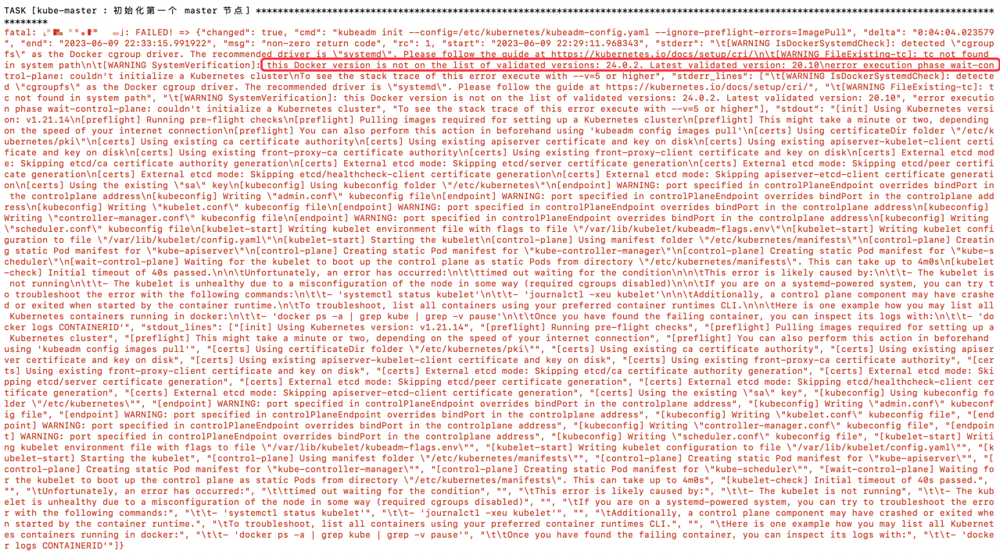
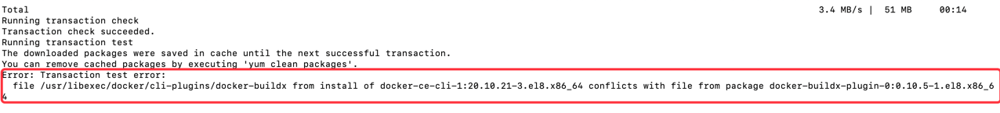
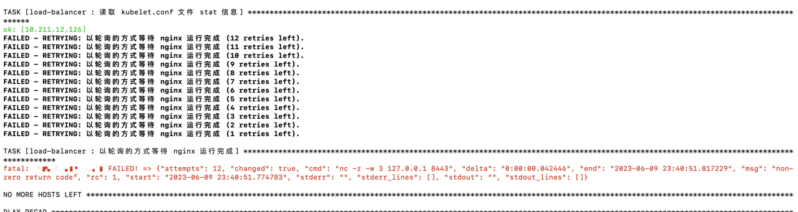
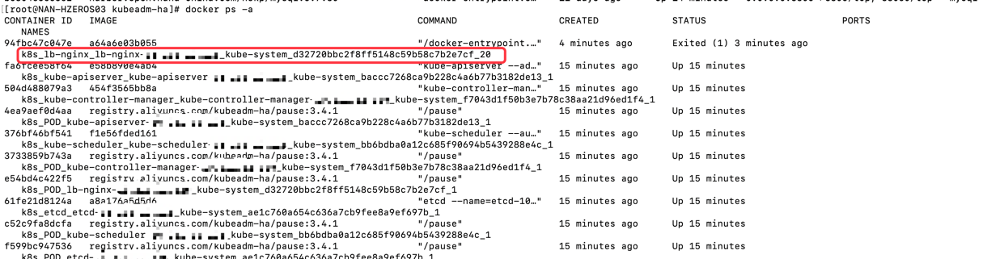
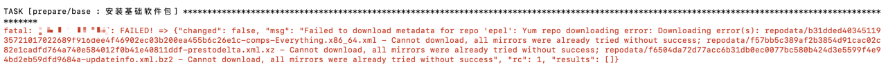
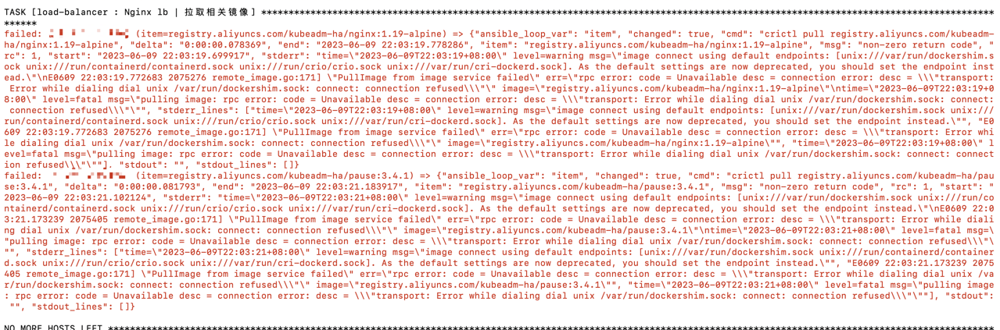
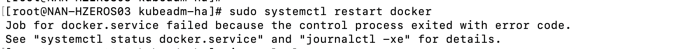
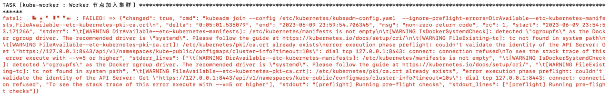
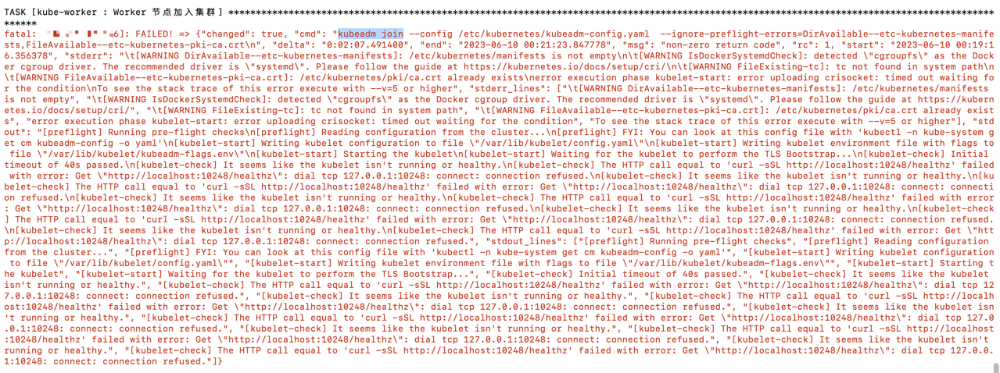
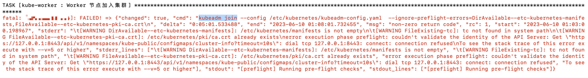

# 添加集群节点

## 添加worker节点
参考文档https://gitee.com/open-hand/kubeadm-ha/blob/release-1.21/docs/02/%E6%B7%BB%E5%8A%A0%20worker%20%E8%8A%82%E7%82%B9.md

添加工作节点与集群安装时初始化工作节点一样,可以在主节点上执行，也可以在要加入的节点执行，只要执行主机安装ansible，并且可以访问主节点及要加入的新节点即可

### 待加入节点未安装docker
需要加入的节点没有安装docker，并且没有装其他应用执行如下指令应该就能正常安装成功
```
ansible-playbook -i example/hosts.s-master.ip.ini 81-add-worker.yml
```

### 待加入节点已安装docker
对于已经安装docker并且部署了应用服务的主机，添加新节点可能会出现各种问题

#### 检查端口占用
kubernetes集群部署需要占用端口，对于已经安装docker、自己应用的主机需要先检查端口是否被占用，如果端口被占用将会导致对应安装组件无法运行
[查看文档了解需要使用到的端口](https://gitee.com/open-hand/kubeadm-ha/blob/release-1.21/docs/00-%E5%AE%89%E8%A3%85%E9%A1%BB%E7%9F%A5.md)

#### 添加kubernetes yum源
添加/etc/yum.repos.d/kubernetes.repo文件，配置kubernetes yum源，内容如下
```
[kubernetes]
baseurl = https://mirrors.aliyun.com/kubernetes/yum/repos/kubernetes-el7-x86_64/
enabled = 0
gpgcheck = 0
name = Kubernetes
```

#### 检查已安装docker版本
安装Kubernetes集群不同版本对docker版本也有要求，如果docker版本不在Kubernetes版本支持范围会报如下错误


如果不在支持范围，并且docker中已经运行了应用不能卸载，则需要对docker进行升级或降级

##### yum对docker进行升级到指定版本
```
# 查看docker-ce版本列表
yum list docker-ce --showduplicates

# 查看docker-ce-cli版本列表
yum list docker-ce-cli --showduplicates

# 选取需要的版本进行升级
yum update -y docker-ce-20.10.21-3.el8 docker-ce-cli-20.10.21-3.el8
```

##### yum对docker进行降级到指定版本
```
# 查看docker-ce版本列表
yum list docker-ce --showduplicates

# 查看docker-ce-cli版本列表
yum list docker-ce-cli --showduplicates

# 将docker降到指定版本
yum downgrade --setopt=obsoletes=0 -y docker-ce-20.10.21-3.el8 docker-ce-cli-20.10.21-3.el8
```

如果从24.0.2-1.el8版本降到20.10.21-3.el8版本则会报如下错误


需要使用如下指令将冲突包docker-buildx-plugin卸载,然后再执行降级指令
```
yum remove docker-buildx-plugin -y
```

#### 修改docker cgroup driver
修改/etc/docker/daemon.json文件内容指定cgroupdriver为systemd，如果不指定默认是使用cgroupfs。并且指定docker拉取镜像仓库，默认是使用dockerhub的公共镜像库比较慢。
如果在你主机上不存在该文件就创建一个
```
{
  "log-driver": "json-file",
  "log-opts": {
    "max-size": "100m"
  },
  "exec-opts": ["native.cgroupdriver=systemd"],
  "registry-mirrors": [
        "http://hub-mirror.c.163.com"
  ],
  "bip": "172.17.10.1/16",
  "data-root": "/u01/data/docker"
}
```

更新完daemon.json文件后运行下面指令使配置生效
```
sudo systemctl daemon-reload

sudo systemctl restart docker
```
- 如果启动docker失败则可以运行journalctl -xe查看详情，首先考虑daemon.json内容是否正确

注意不要使用命令sed -i "s#^ExecStart=/usr/bin/dockerd.*#ExecStart=/usr/bin/dockerd -H fd://
--containerd=/run/containerd/containerd.sock --exec-opt native.cgroupdriver=systemd#g"
/usr/lib/systemd/system/docker.service更新cgroupdriver，如果使用上述指令更新导致docker无法启动，可能是因为/usr/lib/systemd/system/docker.service中
--exec-opt native.cgroupdriver=systemd配置与daemon.json文件中"exec-opts": ["native.cgroupdriver=systemd"]冲突，可以去除/usr/lib/systemd/system/docker.service中
--exec-opt native.cgroupdriver=systemd配置

#### 执行添加新节点指令
执行如下指令
```
ansible-playbook -i example/hosts.s-master.ip.ini 81-add-worker.yml
```

##### nginx运行失败

- 上述错误是nginx运行失败造成的，运行失败的原因大概率是端口占用导致

运行如下命令，查看运行失败的容器
```
docker ps -a
```


查看k8s_lb-nginx_lb-nginx容器日志，查看具体原因
```
docker logs -f 94fbc47c047e
```


- 可以看到错误原因是8081端口占用导致

##### yum基础软件包报错


尝试执行如下指令
```
yum clean all && yum update
```
- 注意yum update会更新yum安装组件的版本到最新，慎用

如果设置了yum代理服务可能会报如下错误

- 此错误是设置了代理服务器，可以通过/etc/yum.conf调整代理或去除代理

##### docker停止运行执行安装报错

- 当前节点已安装docker，但报错确是crictl pull拉取镜像，而不是docker pull。检查发现docker未正常运行

首先尝试如下命令
```
sudo systemctl daemon-reload

sudo systemctl restart docker
```
得到如下报错

- 从报错可以发现并没有说明具体报错原因，可以按提示尝试执行systemctl status docker.service或journalctl -xe查看有价值信息

执行如下指令查看docker重启失败详细信息
```
journalctl -xe
```
得到如下详情信息

- 从报错可以看出，overlay2配置问题导致的，将overlay2配置从/etc/docker/daemon.json中移除。如果docker启动不了大概率是/etc/docker/daemon.json配置有问题

##### docker驱动以及端口占用报错




上面三张图展示的是docker驱动设置、端口占用导致的添加节点失败错误信息。如果反馈信息不能判断问题可以尝试在对应节点执行手工执行命名并添加--v=5查看具体原因
```
kubeadm join --config /etc/kubernetes/kubeadm-config.yaml 
--ignore-preflight-errors=DirAvailable--etc-kubernetes-manifests,FileAvailable--etc-kubernetes-pki-ca.crt --v=5
```
- cgroup driver驱动配置问题：按上面配置cgroup driver

- 某个地址访问不通：查看对应端口组件是否正常运行，大概率是端口被占用了

    - 127.0.0.1:8443： 通常是nginx没有启动，端口被占用
    
    - 127.0.0.1:10248：通常是解决完问题之后重新执行添加节点，忘记应该先要清理掉残留文件导致
    
##### 把问题排查完之后清理残留文件重新执行
在处理好部署报错问题后，需要将安装失败时残留的服务、文件清理干净，以免引发新的问题。执行如下命令完成文件清理
```
kubeadm reset -f
modprobe -r ipip
rm -rf ~/.kube/
rm -rf /etc/kubernetes/
rm -rf /etc/systemd/system/kubelet.service.d
rm -rf /etc/systemd/system/kubelet.service
rm -rf /usr/bin/kube*
rm -rf /etc/cni
rm -rf /opt/cni
rm -rf /var/lib/etcd
rm -rf /var/etcd
yum clean all
yum remove kube*
```

