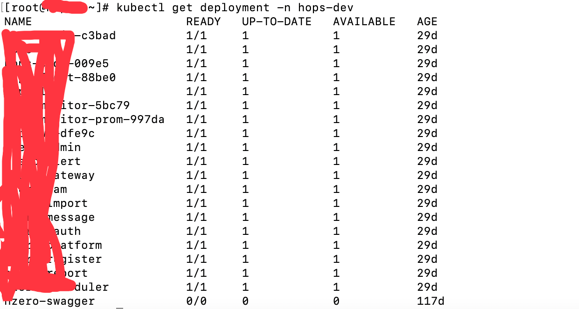

# K8s常用命令

## 通用命令总结

### 查询特定命名空间下的资源
```
kubectl get 资源类型例如：Deployment/Statefulset等等 -n 命名空间
```

### 获取指定资源的yaml文件，此文件包含了资源的各种信息很有用
```
kubectl get 资源类型 资源名称 -n 命名空间 -o yaml
```

### 扩容、缩容资源命令
```
kubectl scale 资源类型 资源实例名称 --replicas 副本数量 -n 命名空间
```
### 修改资源属性
```
kubectl edit 资源类型 资源实例名称 -n hskp
```

## Event事件相关命令

### 获取特定命名空间下的所有事件
```
kubectl get events -n hops-test
```


### 查看命名空间下所有事件的yaml文件
```
kubectl get events -n hops-test -o yaml
```


### 查询指定事件的yaml文件
```
kubectl get event -n hops-test 事件名称（metadata下的name属性值） -o yaml
```


## 命名空间相关命令

### 获取所有命名空间
```
kubectl get namespace
```


### 创建名称空间
```
kubectl create namespace test-namespace
```

## 部署组

### 获取指定命名空间部署组列表
```
kubectl get deployment -n test-dev
```


## 标签

### 为特定资源添加标签
```
kubectl label pod write-pod source=test.io
```

### 显示标签内容
```
kubectl get namespace --show-labels

kubectl get pod -n 命名空间名 --show-labels
```


## pod

### 获取指定命名空间下pod信息
```
kubectl get pod -n 空间名称
```

### 查询pod中包含的容器信息
describe可以查看指定资源的描述信息。其中Containers属性包含容器的名称及其它详细信息

```
kubectl describe pod -n 命名空间 pod名称
```

### 查看容器日志
```
kubectl logs pod名称 -c 容器名称 -n 命名空间名称

kubectl logs -f --tail=50  pod名称 -n 命名空间名称 // 查看日志从最后50行开始输出
```

### 进入pod中指定容器执行命令
```
kubectl exec -it pod名称 -c 容器名称 -n 命名空间 -- /bin/bash
```

### 将容器中的文件复制到主机
```
kubectl cp pod名称:文件路径 复制到主机中的路径及文件名称 -n 需要复制的pod所在命名空间名称
```

### 将主机文件复制到容器
```
kubectl cp 需要复制到容器中的主机路径及文件名称 pod名称:文件路径 -n 需要复制的pod所在命名空间名称
```

