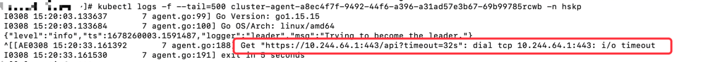

# 删除命名空间一直处于Terminating并且自己开发的客户端无法连接K8s集群

## 查看命名空间删除一直Terminating原因
```
kubectl get namespace hskp -o yaml
```


- 从详情可知metrics.k8s.io/v1beta1 API资源异常无法处理请求

## 查看集群API资源情况
```
kubectl get APIService
```


- 可以看到kube-system命名空间下metrics-server有异常

## 查看kube-system命名空间下metrics-server
```
kubectl get pods -n kube-system
```


- metrics-server的pod一直没有就绪

## 查看metrics-server-595f9c748c-9wz4b未就绪原因
```
kubectl logs -f --tail=500 metrics-server-778d7dcf96-5qh28 -n kube-system
```


- 访问api超时

## 查看自己开发agent工具未连接上K8s集群原因
```
kubectl logs -f --tail=500 cluster-agent-a8ec4f7f-9492-44f6-a396-a31ad57e3b67-69b99785rcwb -n hskp
```


- 同样也是访问api超时

## 查看~/.kube/config配置server是否正确
```
vim ~/.kube/config
```

- 修改为server: https://节点IP:6443

修改之后上述问题依然存在

## 考虑是防火墙（iptables）规则错乱或者缓存导致的访问问题
```
systemctl stop kubelet
systemctl stop docker
iptables --flush
iptables -tnat --flush
systemctl start kubelet
systemctl start docker
```

- 依次执行上述指令

## 验证

- 删除上面有问题pod

- 新拉起pod可以正常运行

- 再运行kubectl delete namespace hskp可以正常删除

## 总结
命名空间无法删除一直Terminating，通常都是集群有些资源出现问题导致的。需要解决集群的异常才能顺利删除。强制删除并不能根本解决问题

